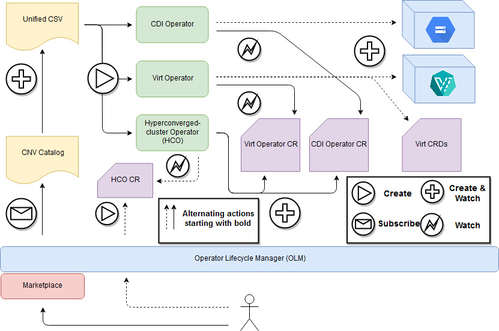

[](https://travis-ci.com/kubevirt/hyperconverged-cluster-operator)
[](https://goreportcard.com/report/github.com/kubevirt/hyperconverged-cluster-operator)
[](https://coveralls.io/github/kubevirt/hyperconverged-cluster-operator?branch=master)

# Hyperconverged Cluster Operator

A unified operator deploying and controlling [KubeVirt](https://github.com/kubevirt/kubevirt) and several adjacent operators:

- [Containerized Data Importer](https://github.com/kubevirt/containerized-data-importer)
- [Scheduling, Scale and Performance](https://github.com/kubevirt/kubevirt-ssp-operator)
- [Cluster Network Addons](https://github.com/kubevirt/cluster-network-addons-operator)
- [Node Maintenance](https://github.com/kubevirt/node-maintenance-operator)

This operator is typically installed from the Operator Lifecycle Manager (OLM),
and creates operator CustomResources (CRs) for its underlying operators as can be seen in the diagrom below.
Use it to obtain an opinionated deployment of KubeVirt and its helper operators.



## Installing HCO using kustomize (Openshift OLM Only)
To install the default community HyperConverged Cluster Operator, along with its underlying components, run:
```bash
$ curl -L https://api.github.com/repos/kubevirt/hyperconverged-cluster-operator/tarball/master | \
tar --strip-components=1 -xvzf - kubevirt-hyperconverged-cluster-operator-*/deploy/kustomize

$ ./deploy/kustomize/deploy_kustomize.sh
```
The deployment is completed when HCO custom resource reports its condition as `Available`.

For more explanation and advanced options for HCO deployment using kustomize, refer to [kustomize deployment documentation](deploy/kustomize/README.md).

## Installing Unreleased Bundles Using Marketplace
The hyperconverged cluster operator will publish the lastest bundles to [quay/kubevirt-hyperconvered/hco-operatohub](https://quay.io/application/kubevirt-hyperconverged/hco-operatorhub)
before publishing to operatorhub.io.

Make the unreleased bundles available in Marketplace by adding the app registry:
```bash
# Remove the hco-bundle from the community-operators sources
$ kubectl get operatorsource -n openshift-marketplace community-operators -o yaml | sed "s/hco-operatorhub,//" | kubectl apply -f -

# Add the unreleases bundle source
$ curl https://raw.githubusercontent.com/kubevirt/hyperconverged-cluster-operator/master/tools/quay-registry.sh | bash -s $QUAY_USERNAME $QUAY_PASSWORD
```

## Using the HCO without OLM or Marketplace

Run the following script to apply the HCO operator:

```bash
$ curl https://raw.githubusercontent.com/kubevirt/hyperconverged-cluster-operator/master/deploy/deploy.sh | bash
```

## Developer Workflow
If you want to make changes to the HCO, here's how you can test your changes
through [OLM](https://github.com/operator-framework/operator-lifecycle-manager/blob/master/doc/install/install.md#installing-olm).

Build the HCO container using the Makefile recipes `make container-build` and
`make container-push` with vars `IMAGE_REGISTRY`, `OPERATOR_IMAGE`, and `IMAGE_TAG`
to direct it's location.

To use the HCO's container, we'll use a registry image to serve metadata to OLM.
Build and push the HCO's registry image.

```bash
export REGISTRY_NAMESPACE=<container_org>
export TAG=example
make bundleRegistry
```

Create the namespace for the HCO.
```bash
kubectl create ns kubevirt-hyperconverged
```

Create an OperatorGroup.
```bash
cat <<EOF | kubectl create -f -
apiVersion: operators.coreos.com/v1
kind: OperatorGroup
metadata:
  name: hco-operatorgroup
  namespace: kubevirt-hyperconverged
spec:
  targetNamespaces:
  - "kubevirt-hyperconverged"
EOF
```

Create a Catalog Source.
```bash
cat <<EOF | kubectl create -f -
apiVersion: operators.coreos.com/v1alpha1
kind: CatalogSource
metadata:
  name: hco-catalogsource
  namespace: openshift-marketplace
spec:
  sourceType: grpc
  image: docker.io/$REGISTRY_NAMESPACE/hco-container-registry:$TAG
  displayName: KubeVirt HyperConverged
  publisher: Red Hat
EOF
```

Create a subscription.
```bash
cat <<EOF | kubectl create -f -
apiVersion: operators.coreos.com/v1alpha1
kind: Subscription
metadata:
  name: hco-subscription
  namespace: kubevirt-hyperconverged
spec:
  channel: "1.0.0"
  name: kubevirt-hyperconverged
  source: hco-catalogsource
  sourceNamespace: openshift-marketplace
EOF
```

Create an HCO CustomResource, which creates the KubeVirt CR, launching KubeVirt,
CDI, Network-addons, VM import and SSP.
```bash
kubectl create -f deploy/hco.cr.yaml -n kubevirt-hyperconverged
```

## Create a Cluster & Launch the HCO
1. Choose the provider
```bash
#For k8s cluster:
$ export KUBEVIRT_PROVIDER="k8s-1.17"
```
```bash
#For okd cluster:
$ export KUBEVIRT_PROVIDER="okd-4.1"
```
2. Navigate to the project's directory
```bash
$ cd <path>/hyperconverged-cluster-operator
```
3. Remove an old cluster
```bash
$ make cluster-down
```
4. Create a new cluster
```bash
$ make cluster-up
```
5. Clean previous HCO deployment and re-deploy HCO \
   (When making a change, execute only this command - no need to repeat steps 1-3)
```bash
$ make cluster-sync
```
### Command-Line Tool
Use `./cluster/kubectl.sh` as the command-line tool.

For example:
```bash
$ ./cluster/kubectl.sh get pods --all-namespaces
```
