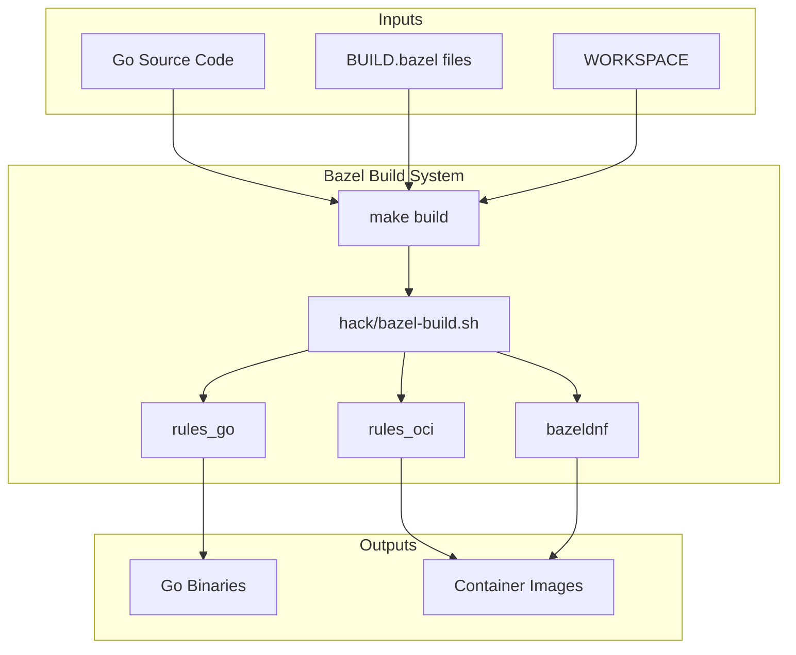
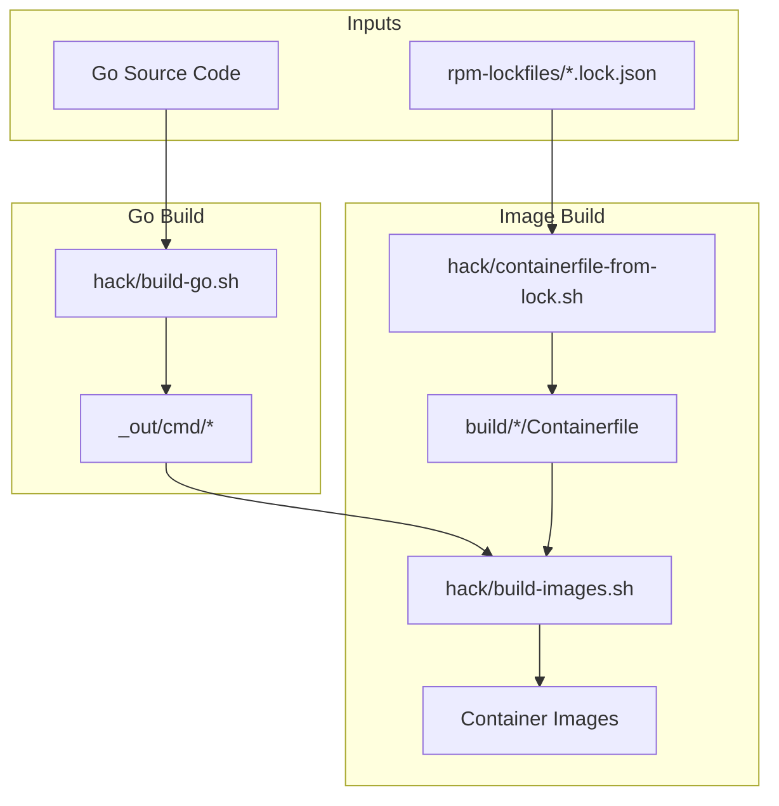

# Bazel Removal Migration Summary

This document summarizes the Bazel features used in KubeVirt, their native
alternatives, trade-offs, and migration status.

## Executive Summary

KubeVirt uses Bazel primarily for:
1. **Go compilation** - Has native alternative (`go build`)
2. **Container image building** - Needs Containerfiles (in progress)
3. **RPM dependency management** - Replaced with native dnf-based scripts
4. **Testing** - Has native alternative (`go test`)

The migration approach is to replace each Bazel feature with standard tooling
while maintaining build reproducibility through lock files.

---

## Build Flow Comparison

### Current Build (with Bazel)



### New Build (without Bazel)



### Key Differences

| Aspect | Bazel | Native |
|--------|-------|--------|
| Go Build | `rules_go` | `go build` via `hack/build-go.sh` |
| RPM Management | `bazeldnf` + `rpm/BUILD.bazel` | `rpm-lockfiles/*.lock.json` |
| Image Build | `rules_oci` | `Containerfile` + `podman/docker` |
| Configuration | `WORKSPACE` + `BUILD.bazel` | Lock files + Containerfiles |

---

## Feature-by-Feature Analysis

### 1. Go Compilation (rules_go)

| Aspect | Details |
|--------|---------|
| **Bazel Tool** | `rules_go` v0.54.1 |
| **What It Does** | Builds Go binaries, libraries, tests with caching |
| **Native Alternative** | `hack/build-go.sh` using standard `go build` |
| **Migration Status** | Ready - use `KUBEVIRT_NO_BAZEL=true` |
| **Difficulty** | Easy |

**Trade-offs:**
- **Pro**: Standard Go toolchain, familiar to developers
- **Pro**: Go has its own build cache (`GOCACHE`)
- **Con**: No remote cache support (Bazel can use remote cache)
- **Con**: Less granular incremental builds

**Solution:** Use native Go toolchain. The `hack/build-go.sh` script already
handles multi-platform builds for `virtctl` and all other binaries.

---

### 2. Container Image Building (rules_oci)

| Aspect | Details |
|--------|---------|
| **Bazel Tool** | `rules_oci` v2.0.1, `rules_docker` v0.16.0 |
| **What It Does** | Builds OCI images with deterministic layering |
| **Native Alternative** | Containerfiles + `podman build` / `buildx` |
| **Migration Status** | In Progress |
| **Difficulty** | Hard |

**Trade-offs:**
- **Pro**: Standard Containerfiles, familiar to developers
- **Pro**: Better integration with CI/CD systems
- **Con**: Lose deterministic layer hashing
- **Con**: Multi-arch builds require `buildx` or `podman manifest`

**Solution:** Create Containerfiles for each image type using
`hack/containerfile-from-lock.sh` which generates optimized multi-stage
builds from RPM lock files.

**Images to migrate (~20):**
- virt-operator, virt-api, virt-controller, virt-handler, virt-launcher
- container-disk-v1alpha (alpine, cirros, fedora)
- conformance, libguestfs-tools
- sidecar images (hook-sidecar, etc.)

---

### 3. RPM Dependency Management (bazeldnf)

| Aspect | Details |
|--------|---------|
| **Bazel Tool** | `bazeldnf` |
| **What It Does** | Resolves RPM dependencies, creates reproducible trees |
| **Native Alternative** | `hack/rpm-freeze-native.sh` + JSON lock files |
| **Migration Status** | Done |
| **Difficulty** | Hard (completed) |

**Trade-offs:**
- **Pro**: Standard dnf tooling, easier to understand
- **Pro**: JSON lock files are human-readable
- **Pro**: SHA256 checksums for supply chain security
- **Con**: Manual regeneration (vs automatic resolution)
- **Con**: Needs container (Fedora/CentOS) to run dnf

**Solution:** Native scripts that replicate bazeldnf behavior:

| Script | Purpose |
|--------|---------|
| `hack/rpm-packages.sh` | Package definitions for all 10 package sets |
| `hack/rpm-freeze-native.sh` | Generate lock file for one arch/set |
| `hack/rpm-freeze-all.sh` | Generate all lock files |
| `hack/rpm-verify.sh` | Verify SHA256 checksums |
| `hack/rpm-compare-bazel.sh` | Compare native vs bazeldnf |

**Package Sets (10):**
- `testimage`, `libvirt-devel`, `sandboxroot`, `launcherbase`
- `handlerbase`, `passt_tree`, `libguestfs-tools`, `exportserverbase`
- `pr-helper`, `sidecar-shim`

**Architectures (3):** x86_64, aarch64, s390x

---

### 4. Testing (go_test)

| Aspect | Details |
|--------|---------|
| **Bazel Tool** | `go_test` targets |
| **What It Does** | Runs tests with caching, parallel execution |
| **Native Alternative** | `go test` via `hack/build-go.sh test` |
| **Migration Status** | Ready |
| **Difficulty** | Easy |

**Trade-offs:**
- **Pro**: Standard Go testing, better IDE integration
- **Pro**: Familiar to developers
- **Con**: No test result caching across runs
- **Con**: Less granular test selection

**Solution:** Use `go test ./...` with standard Go tooling.

---

### 5. Cross-Compilation

| Aspect | Details |
|--------|---------|
| **Bazel Tool** | Platform configs in `.bazelrc` |
| **What It Does** | Cross-compiles for x86_64, aarch64, s390x |
| **Native Alternative** | `GOOS`/`GOARCH` environment variables |
| **Migration Status** | Ready |
| **Difficulty** | Easy |

**Trade-offs:**
- **Pro**: Standard Go cross-compilation
- **Pro**: No special toolchain setup needed for pure Go
- **Con**: CGO cross-compilation needs separate toolchains

**Solution:** Go supports cross-compilation natively. For CGO (libvirt),
use architecture-specific containers or cross-compiler toolchains.

---

### 6. Code Generation (Gazelle)

| Aspect | Details |
|--------|---------|
| **Bazel Tool** | Gazelle |
| **What It Does** | Auto-generates BUILD.bazel files |
| **Native Alternative** | Not needed without Bazel |
| **Migration Status** | Ready (will be removed) |
| **Difficulty** | N/A |

**Solution:** Gazelle is only needed for Bazel. The existing
`hack/generate.sh` handles all code generation (deepcopy-gen, client-gen,
etc.) independently.

---

### 7. Static Analysis (nogo)

| Aspect | Details |
|--------|---------|
| **Bazel Tool** | nogo (integrated with rules_go) |
| **What It Does** | Runs Go vet checks during build |
| **Native Alternative** | `go vet`, golangci-lint |
| **Migration Status** | Ready |
| **Difficulty** | Easy |

**Trade-offs:**
- **Pro**: Can use more analyzers with golangci-lint
- **Pro**: Better IDE integration
- **Con**: Not integrated into build (runs separately)

**Solution:** Run `go vet` and `golangci-lint` in CI. Already configured
in `hack/linter/`.

---

### 8. Build Caching

| Aspect | Details |
|--------|---------|
| **Bazel Tool** | Content-addressable cache, remote cache |
| **What It Does** | Caches build artifacts for fast incremental builds |
| **Native Alternative** | Go build cache, Docker layer cache |
| **Migration Status** | Acceptable |
| **Difficulty** | N/A |

**Trade-offs:**
- **Pro**: Simpler setup, no cache server needed
- **Con**: Less sophisticated caching
- **Con**: No remote cache sharing between CI runs

**Solution:** Rely on Go's built-in cache and Docker layer caching. For
CI, consider using GitHub Actions cache or similar.

---

### 9. Artifact Publishing (oci_push)

| Aspect | Details |
|--------|---------|
| **Bazel Tool** | `oci_push` |
| **What It Does** | Pushes OCI images to registries |
| **Native Alternative** | `podman push`, `buildx push` |
| **Migration Status** | Ready |
| **Difficulty** | Easy |

**Trade-offs:**
- **Pro**: Standard container registry tools
- **Pro**: Better multi-arch manifest support
- **Con**: None significant

**Solution:** Use `podman push` or `docker buildx push` for multi-arch
images. The existing `hack/push-container-manifest.sh` works independently.

---

## Migration Phases

### Phase 1: RPM Infrastructure (COMPLETED)

```
0c0a0fb7d0 hack: add rpm-packages.sh with package definitions
9c38a463c3 hack: add rpm-freeze-native.sh for native RPM freezing
ccc8c9c33a hack: add rpm-freeze-all.sh to generate all lock files
17fec92d03 hack: add rpm-verify.sh for lock file verification
08b624e2ab rpm-lockfiles: add directory for RPM lock files
58437660d5 hack: add containerfile-from-lock.sh for container builds
05f7040236 .gitignore: add rpm-cache directory
9bcde2ed17 hack: fix rpm-freeze-native.sh for exclusion filtering
52205acba3 rpm-lockfiles: add initial lock files for x86_64
9a16ea14ed hack: add rpm-compare-bazel.sh to validate native vs bazeldnf
```

### Phase 2: Validation (COMPLETED)

- [x] Create comparison script
- [x] Create migration summary document
- [x] Generate all lock files (30 files: 10 package sets × 3 architectures)
- [x] Validate all lock files match bazeldnf (28/28 passed)

### Phase 3: Container Images (IN PROGRESS)

- [x] Create `hack/containerfile-from-lock.sh` for generating Containerfiles
- [x] Create `hack/build-images.sh` with Docker/Podman support
- [ ] Create Containerfiles for each image type
- [ ] Test image builds

### Phase 4: Switch Defaults (PLANNED)

- [ ] Set `KUBEVIRT_NO_BAZEL=true` in `hack/common.sh`
- [ ] Update Makefile targets

### Phase 5: Remove Bazel (PLANNED)

- [ ] Remove `hack/bazel-*.sh` (12 files)
- [ ] Remove `.bazelrc`, `.bazelversion`, `bazel/`
- [ ] Remove `BUILD.bazel` files (~1,557 files)
- [ ] Remove `WORKSPACE`

---

## Summary Table

| Feature | Bazel Tool | Native Alternative | Status | Trade-off |
|---------|------------|-------------------|--------|-----------|
| Go Build | rules_go | go build | Ready | Lose remote cache |
| Container Images | rules_oci | Containerfiles | In Progress | Lose deterministic layers |
| RPM Management | bazeldnf | rpm-freeze-native.sh | Done | Manual regeneration |
| Testing | go_test | go test | Ready | Lose test cache |
| Cross-Compile | .bazelrc | GOOS/GOARCH | Ready | None for Go |
| Code Gen | Gazelle | hack/generate.sh | Ready | N/A |
| Static Analysis | nogo | go vet/lint | Ready | Runs separately |
| Caching | Bazel cache | Go/Docker cache | Acceptable | Less sophisticated |
| Publishing | oci_push | podman push | Ready | None |

---

## What We Lose

1. **Remote build caching** - Bazel can share cache across CI runs
2. **Deterministic container layers** - OCI images have reproducible hashes
3. **Integrated static analysis** - nogo runs during build
4. **Fine-grained test caching** - Bazel caches individual test results

## What We Gain

1. **Simpler build system** - Standard Go toolchain
2. **Faster onboarding** - No Bazel installation needed
3. **Better IDE support** - Standard Go tools work better
4. **Easier debugging** - Familiar tools and workflows
5. **Reduced maintenance** - No Bazel version upgrades
6. **Standard Containerfiles** - Familiar to DevOps teams

---

## Validation

Before removing Bazel, validate with:

```bash
# Generate all lock files
./hack/rpm-freeze-all.sh

# Compare with bazeldnf (names-only, allow extras)
./hack/rpm-compare-bazel.sh --names-only --allow-extras

# Strict comparison (may show version differences)
./hack/rpm-compare-bazel.sh --ignore-arch
```

Expected results:
- All Bazel packages should be present in native lock files
- Extra packages are acceptable (transitive dependencies)
- Version differences are expected (newer repos)

---

## Key Discoveries & Technical Notes

### Validation Mode: `--names-only --allow-extras`

The `--names-only --allow-extras` mode is the **correct validation** approach:
- **Ensures we have at least everything bazeldnf has**
- **Extra packages are legitimate dependencies**, not errors

DNF resolves complete dependency trees while bazeldnf does minimal resolution.
For example, when requesting `glibc-langpack-en`, DNF also includes 
`glibc-minimal-langpack` as a transitive dependency. This is correct behavior.

### Package Resolution Differences

bazeldnf and DNF resolve "alternative" packages differently:

1. **glibc-langpack variants** (passt_tree package set):
   - bazeldnf picks architecture-specific langpacks:
     - x86_64: `glibc-langpack-en`
     - aarch64: `glibc-langpack-el`
     - s390x: `glibc-langpack-et`
   - DNF defaults to `glibc-minimal-langpack`
   - **Fix:** Explicitly request the same langpack as bazeldnf

2. **FIPS provider** (aarch64, libguestfs-tools x86_64):
   - bazeldnf picks `fips-provider-next` (experimental FIPS from Kryoptic)
   - DNF picks `openssl-fips-provider` (standard OpenSSL FIPS)
   - Both satisfy the same dependency requirement
   - **Fix:** Explicitly request `fips-provider-next` to match bazeldnf

### Lock File Terminology

"Lock file" is a **generic package management term** (like npm `package-lock.json`
or Go `go.sum`), not DNF-specific terminology. Our `.lock.json` files serve the
same purpose: pinning exact versions and checksums for reproducible builds.

### Container Runtime Support

KubeVirt supports both **Docker** and **Podman** with auto-detection:

```bash
# From hack/common.sh
determine_cri_bin() {
    if [ "${KUBEVIRT_CRI}" = "podman" ]; then
        echo podman
    elif [ "${KUBEVIRT_CRI}" = "docker" ]; then
        echo docker
    else
        # Auto-detect: try podman first, then docker
        if podman ps >/dev/null 2>&1; then
            echo podman
        elif docker ps >/dev/null 2>&1; then
            echo docker
        fi
    fi
}
```

All build scripts use `${KUBEVIRT_CRI}` for container operations. Override with:
- `KUBEVIRT_CRI=podman` - Force Podman
- `KUBEVIRT_CRI=docker` - Force Docker

### Timing Benchmarks

All native scripts include timing output at completion:

```bash
# Enable timing for rpm-freeze-native.sh
RPM_FREEZE_TIMING=true ./hack/rpm-freeze-native.sh x86_64 launcherbase

# rpm-freeze-all.sh and build-images.sh always show timing
./hack/rpm-freeze-all.sh
./hack/build-images.sh virt-launcher
```

Sample timing results (on typical CI hardware):
- Single package set freeze: ~30-60s per arch
- All 30 lock files: ~15-30 minutes
- Single image build: varies by image size
