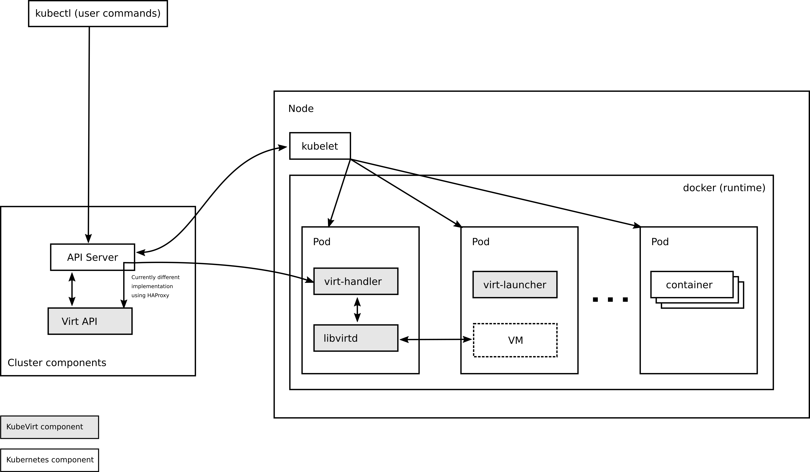

# Architecture

KubeVirt is built using a service oriented architecture and a choreography
pattern.

## Stack

      +---------------------+
      | KubeVirt            |
    ~~+---------------------+~~
      | Orchestration (K8s) |
      +---------------------+
      | Scheduling (K8s)    |
      +---------------------+
      | Container Runtime   |
    ~~+---------------------+~~
      | Operating System    |
      +---------------------+
      | (Virtual)           |
    ~~+---------------------+~~
      | Physical            |
      +---------------------+

Users requiring virtualization services are speaking to the Virtualization API
(see below) which in turn is speaking to the Kubernetes cluster to schedule
requested Virtual Machine Instances (VMIs). Scheduling, networking, and storage 
are all delegated to Kubernetes, while KubeVirt provides the virtualization functionality.

## Additional Services

KubeVirt provides additional functionality to your Kubernetes cluster,
to perform virtual machine management

If we recall how Kubernetes is handling Pods, then we remember that Pods are
created by posting a Pod specification to the Kubernetes API Server.
This specification is then transformed into an object inside the API Server,
this object is of a specific type or _kind_ - that is how it's called in the
specification.
A Pod is of the type `Pod`. Controllers within Kubernetes know how to handle
these Pod objects. Thus once a new Pod object is seen, those controllers
perform the necessary actions to bring the Pod alive, and to match the
required state.

This same mechanism is used by KubeVirt. Thus KubeVirt delivers three things
to provide the new functionality:

1. Additional types - so called [Custom Resource Definition](https://kubernetes.io/docs/concepts/extend-kubernetes/api-extension/custom-resources/) (CRD) - are added to the Kubernetes API
2. Additional controllers for cluster wide logic associated with these new types
3. Additional daemons for node specific logic associated with new types

Once all three steps have been completed, you are able to

- create new objects of these new types in Kubernetes (VMIs in our
  case)
- and the new controllers take care to get the VMIs scheduled on some host,
- and a daemon - the `virt-handler` - is taking care of a host - alongside the
  `kubelet` - to launch the VMI and configure it until it matches the required
  state.

One a final note it is to say that both, the controllers and daemons are running
as Pods (or similar) _on top of_ the Kubernetes cluster, and are not installed
alongside it. The type is - as said before - even defined inside the
Kubernetes API server. This allows users to speak to Kubernetes, but modify VMIs.

The following diagram illustrates how the additional controllers and daemons
communicate with Kubernetes and where the additional types are stored:

## Application Layout

* Cluster
  * KubeVirt Components
    * virt-controller
    * virt-handler
    * libvirtd
    * …
  * KubeVirt Managed Pods
    * VMI Foo
    * VMI Bar
    * …

## Native Workloads

KubeVirt is deployed on top of a Kubernetes cluster.
This means that you can continue to run your Kubernetes-native workloads next
to the VMIs managed through KubeVirt.

Furthermore: if you can run native workloads, and you have KubeVirt installed,
you should be able to run VM-based workloads, too.
For example, Application Operators should not require additional permissions
to use cluster features for VMs, compared to using that feature with a plain Pod.

Security-wise, installing and using KubeVirt must not grant users any permission
they do not already have regarding native workloads. For example, a non-privileged
Application Operator must never gain access to a privileged Pod by using a KubeVirt
feature.

## The Razor

We love virtual machines, think that they are very important and work hard to make
them easy to use in Kubernetes. But even more than VMs, we love good design
and modular, reusable components.
Quite frequently, we face a dilemma: should we solve a problem in KubeVirt in a
way that is best optimized for VMs, or should we take a longer path and introduce
the solution to Pod-based workloads too?

To decide these dilemmas we came up with the **KubeVirt Razor**:
"If something is useful for Pods, we should not implement it only for VMs".

For example, we debated how we should connect VMs to external network
resources. The quickest way seems to introduce KubeVirt-specific code,
attaching a VM to a host bridge.
However, we chose the longer path, of integrating with [Multus](https://github.com/intel/multus-cni)
and [CNI](https://github.com/containernetworking) and improving them.
