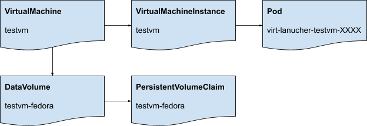

# Backing Up and Restoring KubeVirt resources

## Introduction

This document is intended for developers building backup/disaster recovery solutions for KubeVirt.

Such solutions typically perform the following high level operations.

### Backup

1.  Build dependency graph for all required Kubernetes resources
2.  Quiesce (freeze) applications
3.  Snapshot PersistentVolumeClaim data
4.  Unquiesce (thaw) applications
5.  Copy all necessary Kubernetes resource definitions to a shared storage location
6.  (optional) Export snapshotted PVC data to a shared storage location

Steps 3, 5, and 6 are beyond the scope of this document.

### Restore

1.  Populate PersistentVolumeClaims with snapshot data
2.  Sanitize and apply all relevant Kubernetes resource definitions

Step 1 is beyond the scope of this document.

## Existing KubeVirt Backup Solutions

### Velero Plugin

[Velero](https://velero.io/) is a popular tool for backing up/migrating Kubernetes clusters.  The KubeVirt team actively maintains a [plugin](https://github.com/kubevirt/kubevirt-velero-plugin) for use with Velero.  The plugin implements much of the logic described in this document.

### VirtualMachineSnapshot + VirtualMachineExport API

The [VirtualMachineSnapshot API](https://kubevirt.io/user-guide/operations/snapshot_restore_api/) provides an easy way for KubeVirt users to backup VirtualMachines within a cluster.  On its own, it is not suitable for offsite backup or disaster recovery.  But combined with the [VirtualMachineExport API](https://kubevirt.io/user-guide/operations/export_api/), VirtualMachine volumes may be made available for copy to remote locations.

## Building the KubeVirt Object Graph



In this section, KubeVirt resources and their relationships will be explored by showing how yaml snippets map to nodes in an object graph.

Nodes in the object graph are represented by the following tuple:

(APIGroup, Kind, namespace, name)

### VirtualMachine Object Graph

```yaml
apiVersion: kubevirt.io/v1
kind: VirtualMachine
metadata:
  name: vm1
  namespace: ns1
...
```

- ("kubevirt.io", "VirtualMachine", "ns1", "vm1")

#### spec.instancetype

```yaml
...
spec:
  instancetype:
    kind: VirtualMachineInstancetype
    name: small
...
```

- ("instancetype.kubevirt.io", "VirtualMachineInstancetype", "ns1", "small")

#### spec.preference

```yaml
...
spec:
  preference:
    kind: VirtualMachinePreference
    name: windows
...
```

- ("instancetype.kubevirt.io", "VirtualMachinePreference", "ns1", "windows")

#### spec.template

See [VirtualMachineInstance](#virtualmachineinstance-object-graph)

### VirtualMachineInstance Object Graph

```yaml
apiVersion: kubevirt.io/v1
kind: VirtualMachineInstance
metadata:
  name: vmi1
  namespace: ns1
...
```

- ("kubevirt.io", "VirtualMachineInstance", "ns1", "vmi1")
- ("", "Pod", "ns1", "virt-launcher-vmi1-XXXXX") \*

\* Each VirtualMachineInstance has a corresponding uniquely named Pod.  The backup process can look up the name of this pod by using the `kubevirt.io/created-by=<UID of VirtualMachineInstance>` label selector.

#### spec.volumes[\*].persistentVolumeClaim

```yaml
...
spec:
  volumes:
  - name: v1
    persistentVolumeClaim:
      claimName: pvc1
...
```

- ("", "PersistentVolumeClaim", "ns1", "pvc1")
- ("cdi.kubevirt.io", "DataVolume", "ns1", "pvc1")

#### spec.volumes[\*].dataVolume

```yaml
...
spec:
  volumes:
  - name: v1
    dataVolume:
      name: dv1
...
```

- ("", "PersistentVolumeClaim", "ns1", "dv1")
- ("cdi.kubevirt.io", "DataVolume", "ns1", "dv1")

#### spec.volumes[\*].configMap

```yaml
...
spec:
  volumes:
  - name: v1
    configMap:
      name: cm1
...
```

- ("", "ConfigMap", "ns1", "cm1")

#### spec.volumes[\*].secret

```yaml
...
spec:
  volumes:
  - name: v1
    secret:
      secretName: s1
...
```

- ("", "Secret", "ns1", "s1")

#### spec.volumes[\*].serviceAccount

```yaml
...
spec:
  volumes:
  - name: v1
    serviceAccount:
      serviceAccountName: sa1
...
```

- ("", "ServiceAccount", "ns1", "sa1")

#### spec.volumes[\*].memoryDump

```yaml
...
spec:
  volumes:
  - name: v1
    memoryDump:
      claimName: pvc1
...
```

- ("", "PersistentVolumeClaim", "ns1", "pvc1")

#### spec.accessCredentials[\*].sshPublicKey

```yaml
...
spec:
  accessCredentials:
  - sshPublicKey:
      source:
        secret:
          secretName: my-pub-key
...
```

- ("", "Secret", "ns1", "my-pub-key")

#### spec.accessCredentials[\*].userPassword

```yaml
...
spec:
  accessCredentials:
  - userPassword:
      source:
        secret:
          secretName: my-user-password
...
```

- ("", "Secret", "ns1", "my-user-password")

### VirtualMachineInstanceReplicaSet Object Graph

```yaml
apiVersion: kubevirt.io/v1
kind: VirtualMachineInstanceReplicaSet
metadata:
  name: vmirs1
  namespace: ns1
...
```

- ("kubevirt.io", "VirtualMachineInstanceReplicaSet", "ns1", "vmirs1")
- ("kubevirt.io", "VirtualMachineInstance", "ns1", "vmirs1XXXX1") \*
- ("kubevirt.io", "VirtualMachineInstance", "ns1", "vmirs1XXXX2") \*

\* there are usually multiple VirtualMachineInstances corresponding to a VirtualMachineInstanceReplicaSet.  The backup process can look up the name of this pod by using the `kubevirt.io/vmReplicaSet=<name of VirtualMachineInstanceReplicaSet>` label selector.

#### spec.template

See [VirtualMachineInstance](#virtualmachineinstance-object-graph)

## Backup Actions

### Guest filesystem freeze/thaw hooks

See [this guide](https://github.com/kubevirt/kubevirt/blob/main/docs/freeze.md) for how to execute the freeze/thaw hooks for each VirtualMachineInstance encountered in the object graph.

## Restore Actions

### VirtualMachine Restore

If restoring to a different cluster, and mac address or bios serial number are explicitly set, you should make sure there will be no collisions.  These values are set in:

```
/spec/template/spec/domain/devices/interfaces/<index>/macAddress
/spec/template/spec/domain/firmware/serial
```

### VirtualMachineInstance Restore

If a VirtualMachineInstance is **owned by a VirtualMachine**, it should **not be restored**.  The KubeVirt controller will recreate the resource based on the VirtualMachine definition.  Otherwise, VirtualMachineInstance definitions may be backed up/restored with the same precautions as VirtualMachine for mac address/bios.

```
/spec/domain/devices/interfaces/<index>/macAddress
/spec/domain/firmware/serial
```

### virt-launcher Pod Restore

A Pod with “virt-launcher-” prefix that is ***owned by a VirtualMachineInstance** should not be restored.

### DataVolume Restore

DataVolumes in **Succeeded phase** (status.phase) should have the following **annotation added** at restore time.  Otherwise, the associated PersistentVolumeClaim may get corrupted.  DataVolumes in any phase other than Succeeded do not need to be annotated.

```yaml
cdi.kubevirt.io/storage.prePopulated: <datavolume name>
```

### PersistentVolumeClaim Restore

PersistentVolumeClaims ***owned by DataVolumes*** must have the following ***annotation added*** at backup/restore time.

```yaml
cdi.kubevirt.io/storage.populatedFor: <datavolume name>
```

## Validate backup partner compatibility
In this section, we will describe the different scenarios a backup partner should test in order to assess its compatibility with Kubevirt.

### Prerequisites
Cluster with the backup software and storage existing and Kubevirt + CDI installed.

To validate there are two options:
### Automatically
This requires some extra effort.
The tests are in our kubevirt-velero-plugin [repo](https://github.com/kubevirt/kubevirt-velero-plugin/tree/main/tests) marked with a label `PartnerComp`.
You will need to adjust some env variables and the **backup and restore functions** in those tests.
The env variables to adjust if needed:
export KUBEVIRT_PROVIDER=external
KUBECONFIG
KUBECTL
KVP_STORAGE_CLASS - define the storage class that should be used for the volumes storage (if not set the default is chosen)
KVP_BACKUP_NS - the backup namespace (if not set velero is chosen)
To run the tests run the following command:
`$make TEST_ARGS="--test-args=-ginkgo.label-filter=PartnerComp" test-functional`

### Manually
All the manifests are at: [https://github.com/kubevirt/kubevirt-velero-plugin/tree/main/tests/manifests](https://github.com/kubevirt/kubevirt-velero-plugin/tree/main/tests/manifests)
You will need to replace manually the storageClassName in each yaml with the appropriate storageclass, or you can use the following command instead of each apply in the tests descriptions:
`$cat <YAML_PATH> | sed 's/{{KVP_STORAGE_CLASS}}/<DESIRED_STORAGE_CLASS>/g' | kubectl create -f -n <NAMESPACE> -`

#### VMI with a standalone DV
Create namespace
`$kubectl create ns <NAMESPACE>`

Apply DV yaml and wait for it to reach Succeeded state
`$kubectl apply -f -n <NAMESPACE> dv-with-guest-agent-image.yaml`

Apply VMI yaml and wait for it to be Running:
`$kubectl apply -f -n <NAMESPACE> vmi_with_dv.yaml.yaml`
Make sure you see in the VMI conditions `AgentConnected`

Create backup for the namespace, wait for it to complete successfully.

Delete namespace

Create restore from the backup and wait for completion.

Check DV reaches succeeded state right away.

Check VMI reaches Running state.

#### VM stopped with ConfigMap, Secret and DVTemplate
Create namespace
`$kubectl create ns <NAMESPACE>`

Apply ConfigMap
`$kubectl apply -f -n <NAMESPACE> configmap.yaml`

Apply Secret
`$kubectl apply -f -n <NAMESPACE> secret.yaml`

Apply VM yaml and wait for it to be Running:
`$kubectl apply -f -n <NAMESPACE> vm_with_different_volume_types.yaml`

Stop VM and wait for it to be Stopped

Create backup for the namespace, wait for it to complete successfully.

Delete namespace

Create restore from the backup and wait for completion.

Check DV reaches succeeded state right away.

check ConfigMap and Secret exists

Check VM is in stopped state.

Start VM and wait for it to be Running.

#### VM running with standalone PVC
Create namespace
`$kubectl create ns <NAMESPACE>`

Apply DV manifest to get a populated PVC wait for DV to be succeeded:
`$kubectl apply -f -n <NAMESPACE> dv-for-pvc.yaml`

Apply VM yaml and wait for it to be Running:
`$kubectl apply -f -n <NAMESPACE> vm_with_pvc.yaml`

Stop VM and wait for it to be Stopped

Create backup for the namespace, wait for it to complete successfully.

Delete namespace

Create restore from the backup and wait for completion.

Check PVC exists and Bound

Check VM reaches Running state.

#### VM with hotplug
Create namespace
`$kubectl create ns <NAMESPACE>`

Apply VM yaml and wait for it to be Running:
`$kubectl apply -f -n <NAMESPACE> vm_for_hotplug.yaml`

Apply DV manifest and wait for it to be succeeded:
`$kubectl apply -f -n <NAMESPACE> blank_datavolume.yaml`

Dynamically attach a volume to the running VM.
`$virtctl addvolume test-vm-for-hotplug --volume-name=test-dv`
Wait to see the attached volume in the VMI volumes and disks lists(vmi.Spec.Volumes, vmi.Spec.Domain.Devices.Disks)

Create backup for the namespace, wait for it to complete successfully.

Delete namespace

Create restore from the backup and wait for completion.

Check DV test-dv succeeded state right away.

Check VM reaches Running state and that the attached volume is in the VMI volumes and disks lists(vmi.Spec.Volumes, vmi.Spec.Domain.Devices.Disks)

#### VM with instancetype and preference
Create namespace
`$kubectl create ns <NAMESPACE>`

Apply Instancetype
`$kubectl apply -f -n <NAMESPACE> instancetype.yaml`

Apply Preference
`$kubectl apply -f -n <NAMESPACE> preference.yaml`

Apply VM yaml and wait for it to be Running:
`$kubectl apply -f -n <NAMESPACE> vm_with_instancetype_and_preference.yaml`
Check revision names updated in VM spec (vm.Spec.Instancetype.RevisionName, vm.Spec.Preference.RevisionName)

Create backup for the namespace, wait for it to complete successfully.

Delete namespace

Create restore from the backup and wait for completion.

Check VM reaches Running state
