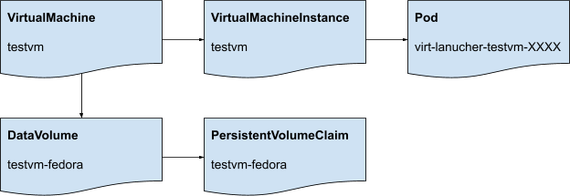

# Backing Up and Restoring KubeVirt resources

## Introduction

This document is intended for developers building backup/disaster recovery solutions for KubeVirt.

Such solutions typically perform the following high level operations.

### Backup

1.  Build dependency graph for all required Kubernetes resources
2.  Quiesce (freeze) applications
3.  Snapshot PersistentVolumeClaim data
4.  Unquiesce (thaw) applications
5.  Copy all necessary Kubernetes resource definitions to a shared storage location
6.  (optional) Export snapshotted PVC data to a shared storage location

Steps 3, 5, and 6 are beyond the scope of this document.

### Restore

1.  Populate PersistentVolumeClaims with snapshot data
2.  Sanitize and apply all relevant Kubernetes resource definitions

Step 1 is beyond the scope of this document.

## Existing KubeVirt Backup Solutions

### Velero Plugin

[Velero](https://velero.io/) is a popular tool for backing up/migrating Kubernetes clusters.  The KubeVirt team actively maintains a [plugin](https://github.com/kubevirt/kubevirt-velero-plugin) for use with Velero.  The plugin implements much of the logic described in this document.

### VirtualMachineSnapshot + VirtualMachineExport API

The [VirtualMachineSnapshot API](https://kubevirt.io/user-guide/operations/snapshot_restore_api/) provides an easy way for KubeVirt users to backup VirtualMachines within a cluster.  On its own, it is not suitable for offsite backup or disaster recovery.  But combined with the [VirtualMachineExport API](https://kubevirt.io/user-guide/operations/export_api/), VirtualMachine volumes may be made available for copy to remote locations.

## Building the KubeVirt Object Graph



In this section, KubeVirt resources and their relationships will be explored by showing how yaml snippets map to nodes in an object graph.

Nodes in the object graph are represented by the following tuple:

(APIGroup, Kind, namespace, name)

### VirtualMachine Object Graph

```yaml
apiVersion: kubevirt.io/v1
kind: VirtualMachine
metadata:
  name: vm1
  namespace: ns1
...
```

- ("kubevirt.io", "VirtualMachine", "ns1", "vm1")

#### spec.instancetype

```yaml
...
spec:
  instancetype:
    kind: VirtualMachineInstancetype
    name: small
    revisionName: vm1-small-XXXXX-1
...
```

- ("instancetype.kubevirt.io", "VirtualMachineInstancetype", "ns1", "small")
- ("apps", "controllerrevisions", "ns1", "vm1-small-XXXXX-1")

#### spec.preference

```yaml
...
spec:
  preference:
    kind: VirtualMachinePreference
    name: windows
    revisionName: vm1-windows-XXXXX-1
...
```

- ("instancetype.kubevirt.io", "VirtualMachinePreference", "ns1", "windows")
- ("apps", "controllerrevisions", "ns1", "vm1-windows-XXXXX-1")

#### spec.template

See [VirtualMachineInstance](#virtualmachineinstance-object-graph)

### VirtualMachineInstance Object Graph

```yaml
apiVersion: kubevirt.io/v1
kind: VirtualMachineInstance
metadata:
  name: vmi1
  namespace: ns1
...
```

- ("kubevirt.io", "VirtualMachineInstance", "ns1", "vmi1")
- ("", "Pod", "ns1", "virt-launcher-vmi1-XXXXX") \*

\* Each VirtualMachineInstance has a corresponding uniquely named Pod.  The backup process can look up the name of this pod by using the `kubevirt.io/created-by=<UID of VirtualMachineInstance>` label selector.

#### spec.volumes[\*].persistentVolumeClaim

```yaml
...
spec:
  volumes:
  - name: v1
    persistentVolumeClaim:
      claimName: pvc1
...
```

- ("", "PersistentVolumeClaim", "ns1", "pvc1")
- ("cdi.kubevirt.io", "DataVolume", "ns1", "pvc1")

#### spec.volumes[\*].dataVolume

```yaml
...
spec:
  volumes:
  - name: v1
    dataVolume:
      name: dv1
...
```

- ("", "PersistentVolumeClaim", "ns1", "dv1")
- ("cdi.kubevirt.io", "DataVolume", "ns1", "dv1")

#### spec.volumes[\*].configMap

```yaml
...
spec:
  volumes:
  - name: v1
    configMap:
      name: cm1
...
```

- ("", "ConfigMap", "ns1", "cm1")

#### spec.volumes[\*].secret

```yaml
...
spec:
  volumes:
  - name: v1
    secret:
      secretName: s1
...
```

- ("", "Secret", "ns1", "s1")

#### spec.volumes[\*].serviceAccount

```yaml
...
spec:
  volumes:
  - name: v1
    serviceAccount:
      serviceAccountName: sa1
...
```

- ("", "ServiceAccount", "ns1", "sa1")

#### spec.volumes[\*].memoryDump

```yaml
...
spec:
  volumes:
  - name: v1
    memoryDump:
      claimName: pvc1
...
```

- ("", "PersistentVolumeClaim", "ns1", "pvc1")

#### spec.accessCredentials[\*].sshPublicKey

```yaml
...
spec:
  accessCredentials:
  - sshPublicKey:
      source:
        secret:
          secretName: my-pub-key
...
```

- ("", "Secret", "ns1", "my-pub-key")

#### spec.accessCredentials[\*].userPassword

```yaml
...
spec:
  accessCredentials:
  - userPassword:
      source:
        secret:
          secretName: my-user-password
...
```

- ("", "Secret", "ns1", "my-user-password")

#### Backend Storage PVC

The backend storage PVC (also known as **persistent state PVC**) is used to persist changes made by a VirtualMachineInstance that are outside the guest. This includes:
- **EFI firmware settings**: Firmware data is stored here such as EFI vars or custom secure boot certificates.
- **TPM state**: Information stored inside the TPM.

For a VM or VMI to use this PVC, it must be explicitly enabled through one or both of the following fields in the VMI spec:
1. `spec.domain.firmware.bootloader.efi.persistent`
2. `spec.domain.devices.tpm.persistent`

When either of these options is set to `true`, the system ensures that the backend PVC is created and attached to the VMI.

**How to Identify the Backend Storage PVC**
Currently, this PVC is not reflected in the VMI or VM spec, but is created and handled by a controller once the VMI is started. The backend PVC can be identified by the `persistent-state-for` label, which would be set to the name of the VMI it is associated with.

```yaml
apiVersion: v1
kind: PersistentVolumeClaim
metadata:
  name: persistent-state-vmi1-XXXXX
  namespace: ns1
  labels:
    persistent-state-for: vmi1
...
```

- ("", "PersistentVolumeClaim", "ns1", "persistent-state-vmi1-XXXXX")

### VirtualMachineInstanceReplicaSet Object Graph

```yaml
apiVersion: kubevirt.io/v1
kind: VirtualMachineInstanceReplicaSet
metadata:
  name: vmirs1
  namespace: ns1
...
```

- ("kubevirt.io", "VirtualMachineInstanceReplicaSet", "ns1", "vmirs1")
- ("kubevirt.io", "VirtualMachineInstance", "ns1", "vmirs1XXXX1") \*
- ("kubevirt.io", "VirtualMachineInstance", "ns1", "vmirs1XXXX2") \*

\* there are usually multiple VirtualMachineInstances corresponding to a VirtualMachineInstanceReplicaSet.  The backup process can look up the name of this pod by using the `kubevirt.io/vmReplicaSet=<name of VirtualMachineInstanceReplicaSet>` label selector.

#### spec.template

See [VirtualMachineInstance](#virtualmachineinstance-object-graph)

### VirtualMachineTemplate Object Graph

```yaml
apiVersion: template.kubevirt.io/v1beta1
kind: VirtualMachineTemplate
metadata:
  name: vmt1
  namespace: ns1
...
```

- ("template.kubevirt.io", "VirtualMachineTemplate", "ns1", "vmt1")

A VirtualMachineTemplate holds an **unprocessed** VirtualMachine under `spec.virtualMachine`, in which any field may still be a `${PARAMETER}` or `${{PARAMETER}}` placeholder.  The embedded VirtualMachine is traversed like a regular [VirtualMachine](#virtualmachine-object-graph), with three important differences:

1.  **Parameterized references must be skipped, unless the parameter has a fixed value.**  A name or namespace containing `${PARAMETER}` cannot be resolved to a concrete object at backup time unless the corresponding entry's `spec.parameters[*].value` is set, in which case that value can be substituted and the reference followed normally.  A parameter using `generate` (currently only `expression` is supported) produces a random value instead and can never be resolved this way, so it must still be skipped.  Otherwise no graph node should be created for it.
2.  **Non-string parameters require care when decoding.**  The `${{PARAMETER}}` syntax deliberately stores a string where the VirtualMachine schema expects another type (for example `cpu.cores: ${{COUNT}}`).  This only breaks decoding if the embedded VirtualMachine is unmarshaled into a concrete type; implementations that process it as unstructured data can leave it in place.  Where decoding into a concrete type is required, such fields should preferably be substituted with the parameter's `spec.parameters[*].value` (if set) before processing, rather than simply stripped.
3.  **No backend storage PVC.**  A template has no running VirtualMachineInstance, so there is no [backend storage PVC](#backend-storage-pvc) to look up.

#### spec.virtualMachine.spec.instancetype / spec.preference

```yaml
...
spec:
  virtualMachine:
    spec:
      instancetype:
        kind: VirtualMachineInstancetype
        name: small
      preference:
        kind: VirtualMachinePreference
        name: windows
...
```

- ("instancetype.kubevirt.io", "VirtualMachineInstancetype", "ns1", "small")
- ("instancetype.kubevirt.io", "VirtualMachinePreference", "ns1", "windows")

Only **namespaced** kinds (`VirtualMachineInstancetype`, `VirtualMachinePreference`) are part of the graph.  An unset `kind` defaults to the cluster scoped `VirtualMachineClusterInstancetype`/`VirtualMachineClusterPreference` and should not be followed.

KubeVirt matches `kind` case-insensitively and also accepts the plural resource name (e.g. `virtualmachineinstancetypes`), so implementations should not rely on an exact match against the CamelCase singular shown here.  Note also that templates produced by a VirtualMachineTemplateRequest only ever keep cluster-scoped matchers, since namespaced ones are expanded into the spec at template-creation time; a namespaced `kind` therefore only occurs in hand-written templates.

Unlike a [VirtualMachine](#specinstancetype), no ControllerRevision node is added here: a VirtualMachineTemplateRequest always clears `revisionName` when generating a template — either by expanding the instancetype/preference directly into the VM spec, or by keeping a cluster-scoped reference with `revisionName` cleared — specifically so that no ControllerRevision ever needs to be copied into the template.  A hand-written template could still carry a `revisionName` copied in by hand; if so it should be followed and a `("apps", "controllerrevisions", "ns1", "<revisionName>")` node added, but unlike for a real VirtualMachine there is no guarantee the referenced ControllerRevision actually exists.

#### spec.virtualMachine.spec.dataVolumeTemplates[\*].spec.source.pvc

```yaml
...
spec:
  virtualMachine:
    spec:
      dataVolumeTemplates:
      - metadata:
          name: ${NAME}-rootdisk
        spec:
          source:
            pvc:
              namespace: golden-images
              name: fedora
...
```

- ("", "PersistentVolumeClaim", "golden-images", "fedora")
- ("cdi.kubevirt.io", "DataVolume", "golden-images", "fedora") \*

This is the **golden image** backing the template's disk.  A template produced from an existing VirtualMachine gets a golden image in its own namespace, while a template referencing a shared base image points at another namespace.  When `namespace` is omitted it defaults to the namespace of the VirtualMachineTemplate — this default applies equally to `source.snapshot` and `sourceRef` below, not just `source.pvc`.  (A DataSource's own `spec.source.*` references instead default to the DataSource's own namespace, not the VirtualMachineTemplate's.)

\* The DataVolume node only exists if a DataVolume of that name actually exists at backup time, since a golden image may be a plain PersistentVolumeClaim.  This cannot be re-checked at restore time, because the source cluster may be gone.  The backup process should therefore **record which golden images had a backing DataVolume** on the VirtualMachineTemplate itself, so that the same graph can be reconstructed at restore time.  The Velero plugin does this with a `velero.kubevirt.io/golden-image-data-volumes` annotation holding a comma separated list of `namespace/name` keys.  Such a record has to be **cleared** when it no longer applies, otherwise a later backup taken after the DataVolume was removed would still ask the restore to look for it.

#### spec.virtualMachine.spec.dataVolumeTemplates[\*].spec.source.snapshot

```yaml
...
spec:
  virtualMachine:
    spec:
      dataVolumeTemplates:
      - metadata:
          name: ${NAME}-rootdisk
        spec:
          source:
            snapshot:
              namespace: golden-images
              name: fedora-snapshot
...
```

- ("snapshot.storage.k8s.io", "VolumeSnapshot", "golden-images", "fedora-snapshot")

#### spec.virtualMachine.spec.dataVolumeTemplates[\*].spec.sourceRef

```yaml
...
spec:
  virtualMachine:
    spec:
      dataVolumeTemplates:
      - metadata:
          name: ${NAME}-rootdisk
        spec:
          sourceRef:
            kind: DataSource
            namespace: golden-images
            name: fedora
...
```

- ("cdi.kubevirt.io", "DataSource", "golden-images", "fedora")

A `sourceRef` typically points at a DataSource in a shared OS images namespace that is managed by a `DataImportCron`.  Such a DataSource carries a `cdi.kubevirt.io/dataImportCron: <cron-name>` label.  Restoring or overwriting it risks conflicting with the cron that manages it, so backup solutions should consider warning on or skipping DataImportCron-managed DataSources (identifiable by that label) and relying on the cron to recreate them instead.

A DataSource reached this way carries references of its own under `spec.source.pvc`, `spec.source.snapshot` and `spec.source.dataSource`, which should be followed in turn.

#### spec.virtualMachine.spec.template

The embedded VirtualMachineInstance template contributes the same `spec.volumes[*]` and `spec.accessCredentials[*]` nodes as a regular [VirtualMachineInstance](#virtualmachineinstance-object-graph), minus any parameterized reference.  There is no virt-launcher Pod node, since the template describes a VirtualMachine that has never run.

It also contributes a node for each `spec.networks[*].multus`:

```yaml
...
spec:
  networks:
  - name: n1
    multus:
      networkName: ns2/nad1
...
```

- ("k8s.cni.cncf.io", "NetworkAttachmentDefinition", "ns2", "nad1")

`networkName` carries the namespace as a `<namespace>/<name>` prefix.  A bare `<name>` refers to a NetworkAttachmentDefinition in the namespace of the VirtualMachineTemplate.

`spec.networks[*].multus` is a regular VirtualMachineInstance field rather than something specific to templates; adding it to the [VirtualMachineInstance Object Graph](#virtualmachineinstance-object-graph) is tracked as follow-up work.  It is documented here because restoring a VirtualMachineTemplate into a different namespace also needs to remap it (see [VirtualMachineTemplate Restore](#virtualmachinetemplate-restore)).

## Backup Actions

### Guest filesystem freeze/thaw hooks

See [this guide](https://github.com/kubevirt/kubevirt/blob/main/docs/freeze.md) for how to execute the freeze/thaw hooks for each VirtualMachineInstance encountered in the object graph.

### VirtualMachineTemplate golden images

A [VirtualMachineTemplate](#virtualmachinetemplate-object-graph) and its golden images should be backed up **as a single unit**, so that a template is never captured without the images it references.

Golden images are the most common way a template backup silently ends up incomplete.  A golden image is a standalone object that carries none of the labels of the template referencing it, and it may live in a **different namespace**.  A backup scoped by label selector or by namespace will therefore match the template but miss its golden image, unless the backup process follows the object graph and pulls the image in explicitly.

Cross-namespace backups are significantly harder to support well, since most backup tools scope both backup and restore to a namespace.  Same-namespace golden images should be treated as the common, well-supported case; a backup process should at minimum warn when a referenced golden image lives outside the namespace being backed up.

It is worth warning the user when a golden image will not be restorable:

- DataVolumes or PersistentVolumeClaims are excluded from the backup entirely.
- The golden image DataVolume is individually marked as excluded.  Velero uses a `velero.io/exclude-from-backup` label for this.

Unlike a VirtualMachine, an incomplete VirtualMachineTemplate backup does **not** risk a corrupted snapshot.  It just produces a template that cannot be processed into a fully working VirtualMachine.  Missing golden images are therefore a reasonable warning rather than a hard failure.

These checks do not apply to backups that exclude volume data entirely (e.g. Velero's `snapshotVolumes: false`), since such backups never intend to capture volume data in the first place.

## Restore Actions

### VirtualMachine Restore

If restoring to a different cluster, and mac address or bios serial number are explicitly set, you should make sure there will be no collisions.  These values are set in:

```
/spec/template/spec/domain/devices/interfaces/<index>/macAddress
/spec/template/spec/domain/firmware/serial
```

### VirtualMachineInstance Restore

If a VirtualMachineInstance is **owned by a VirtualMachine**, it should **not be restored**.  The KubeVirt controller will recreate the resource based on the VirtualMachine definition.  Otherwise, VirtualMachineInstance definitions may be backed up/restored with the same precautions as VirtualMachine for mac address/bios.

```
/spec/domain/devices/interfaces/<index>/macAddress
/spec/domain/firmware/serial
```

### virt-launcher Pod Restore

A Pod with “virt-launcher-” prefix that is ***owned by a VirtualMachineInstance** should not be restored.

### DataVolume Restore

DataVolumes in **Succeeded phase** (status.phase) should have the following **annotation added** at restore time.  Otherwise, the associated PersistentVolumeClaim may get corrupted.  DataVolumes in any phase other than Succeeded do not need to be annotated.

```yaml
cdi.kubevirt.io/storage.prePopulated: <datavolume name>
```

### PersistentVolumeClaim Restore

PersistentVolumeClaims ***owned by DataVolumes*** must have the following ***annotation added*** at backup/restore time.

```yaml
cdi.kubevirt.io/storage.populatedFor: <datavolume name>
```

### VirtualMachineTemplate Restore

Backup solutions usually offer to restore into a **different namespace** than the one that was backed up.  Such a namespace mapping is normally applied to `metadata.namespace` only, which is not enough for a VirtualMachineTemplate: its spec is opaque and embeds namespace references of its own.  The following fields should be rewritten according to the namespace mapping:

```
/spec/virtualMachine/spec/dataVolumeTemplates/<index>/spec/source/pvc/namespace
/spec/virtualMachine/spec/dataVolumeTemplates/<index>/spec/source/snapshot/namespace
/spec/virtualMachine/spec/dataVolumeTemplates/<index>/spec/sourceRef/namespace
/spec/virtualMachine/spec/template/spec/networks/<index>/multus/networkName
```

`multus.networkName` carries the namespace as a `<namespace>/<name>` prefix, which has to be split off and remapped separately.

A DataSource reached through `sourceRef` carries the same kind of reference one hop further out, in `spec.source.pvc.namespace`, `spec.source.snapshot.namespace` and `spec.source.dataSource.namespace` — note that unlike the other two, `spec.source.dataSource.namespace` must end up matching the DataSource's own (rewritten) namespace, since CDI rejects a cross-namespace `source.dataSource`.

Fields that should be **left alone**:

- `/spec/virtualMachine/metadata/namespace`.  virt-template strips a hardcoded namespace when it processes the template.
- Any value that is still a `${PARAMETER}` placeholder.

Two limitations are worth being aware of:

- Golden image DataVolumes created by a VirtualMachineTemplateRequest are **owned by** the VirtualMachineTemplate.  Backup solutions that clear `ownerReferences` on restore (Velero does) produce usable DataVolumes that are no longer garbage collected together with their template.  A template referencing a shared golden image in another namespace does not own it.
- With the Velero plugin, templates using the non-string `${{PARAMETER}}` syntax cannot have their embedded VirtualMachine decoded into a concrete type, so their golden images are not discovered and their namespace references are not rewritten.  The template itself is still backed up and restored intact.  Implementations that process the embedded VirtualMachine as unstructured data are not affected by this limitation.

### VirtualMachineTemplateRequest Backup/Restore

A VirtualMachineTemplateRequest ideally should **not be backed up** in the first place: it is a one shot job with no ongoing purpose once it has produced its VirtualMachineTemplate, which is backed up and restored on its own (see [VirtualMachineTemplate Restore](#virtualmachinetemplate-restore)).

If it is backed up anyway, it should **not be restored**.  Its spec is immutable, so there is no way to recover once a restored request starts reconciling again.  Since restoring an object typically clears its status, a restored request has no `Progressing` condition and is reconciled from scratch.  The controller looks up the existing template before attempting any new snapshot: if the VirtualMachineTemplate was also restored, its `template.kubevirt.io/RequestUID` label no longer matches the restored request's new UID, so the request fails immediately without re-snapshotting.  Only if the VirtualMachineTemplate was *not* restored does the request go on to re-snapshot the source VirtualMachine, which may no longer be the same one by then.  Also note that with `ttlSecondsAfterFinished` set, the request may already be garbage collected by the time a backup is taken.

## Validate backup partner compatibility
In this section, we will describe the different scenarios a backup partner should test in order to assess its compatibility with Kubevirt.

### Prerequisites
Cluster with the backup software and storage existing and Kubevirt + CDI installed.

To validate there are two options:
### Automatically
We have made if possible for our partners to test their compatibility automatically by filling out an example template with a predefined API with their solution implementation of backup and restore. By doing that and defining some env variables you can ran a basic set of tests to determine the compatibility of the backup restore solution with kubevirt.
Please refer to [partner-compatibility-testing](https://github.com/kubevirt/kubevirt-velero-plugin/blob/main/partner-compatibility-testing.md) for more information.

### Manually
As an alternative you can run yourselves the following scenarios with this given manifests:
All the manifests are at: [https://github.com/kubevirt/kubevirt-velero-plugin/tree/main/tests/manifests](https://github.com/kubevirt/kubevirt-velero-plugin/tree/main/tests/manifests)
You will need to replace manually the storageClassName in each yaml with the storageclass you have in your cluster
`$kubectl get storageclass`
or you can use the following command instead of each apply in the tests descriptions:
`$cat <YAML_PATH> | sed 's/{{KVP_STORAGE_CLASS}}/<DESIRED_STORAGE_CLASS>/g' | kubectl create -f -n <NAMESPACE> -`

`vmtr_from_vm.yaml` contains a `{{KVP_NAMESPACE}}` placeholder (not `{{KVP_STORAGE_CLASS}}`) in `spec.virtualMachineRef.namespace`, which must be substituted with `<NAMESPACE>` before applying it:
`$cat tests/manifests/vmtr_from_vm.yaml | sed 's/{{KVP_NAMESPACE}}/<NAMESPACE>/g' | kubectl create -f -n <NAMESPACE> -`

#### Stopped VM with DataVolume and DataVolumeTemplate
Create namespace
`$kubectl create ns <NAMESPACE>`

Apply blank datavolume and wait for it to be Succeeded:
`$kubectl apply -f -n <NAMESPACE> blank_datavolume.yaml`

Apply VM yaml and wait for it to be Running:
`$kubectl apply -f -n <NAMESPACE> vm_with_dv_and_dvtemplate.yaml`

Write some data. Example:
Access to the VM console
`$virtctl console test-vm-with-dv-and-dvtemplate`
In the console
`$echo "testing" > test.txt`

Stop VM and wait for it to be Stopped
`$virtctl stop test-vm-with-dv-and-dvtemplate`

Create backup for the namespace, wait for it to complete successfully.

Delete VM and Datavolume 
`$kubectl delete -n <NAMESPACE> vm test-vm-with-dv-and-dvtemplate`
`$kubectl delete -n <NAMESPACE> datavolume test-dv`

Create restore from the backup and wait for completion.

Check DV reaches succeeded state right away.

Check VM is in stopped state.

Start VM and wait for it to be Running. Verify data exists.

#### VM running with standalone PVC
Create namespace
`$kubectl create ns <NAMESPACE>`

Create ImportVolumeSource 
`$kubectl apply -f -n <NAMESPACE> volume_import_source.yaml`

Create PVC populated by the ImportVolumeSource
`$kubectl apply -f -n <NAMESPACE> import_populator_pvc.yaml`

Apply VM yaml and wait for it to be Running:
`$kubectl apply -f -n <NAMESPACE> vm_with_pvc.yaml`

Write some data. Example:
Access to the VM console
`$virtctl console test-vm-with-pvc`
In the console
`$echo "testing" > test.txt`

Create backup for the namespace, wait for it to complete successfully.

Delete the Namespace

Create restore from the backup and wait for completion.

Check PVC exists and Bound

Check VM exists and running. Verify data exists.

#### VM with hotplug
Create namespace
`$kubectl create ns <NAMESPACE>`

Apply VM yaml and wait for it to be Running:
`$kubectl apply -f -n <NAMESPACE> vm_for_hotplug.yaml`

Apply DV manifest and wait for it to be succeeded:
`$kubectl apply -f -n <NAMESPACE> blank_datavolume.yaml`

Dynamically attach a volume to the running VM.
`$virtctl addvolume test-vm-for-hotplug --volume-name=test-dv`
Wait to see the attached volume in the VMI volumes and disks lists(vmi.Spec.Volumes, vmi.Spec.Domain.Devices.Disks)

Create backup for the namespace, wait for it to complete successfully.

Delete namespace

Create restore from the backup and wait for completion.

Check DV test-dv succeeded state right away.

Check VM reaches Running state and that the attached volume is in the VMI volumes and disks lists(vmi.Spec.Volumes, vmi.Spec.Domain.Devices.Disks)

#### VM stopped with ConfigMap, Secret and DVTemplate
Create namespace
`$kubectl create ns <NAMESPACE>`

Apply ConfigMap
`$kubectl apply -f -n <NAMESPACE> configmap.yaml`

Apply Secret
`$kubectl apply -f -n <NAMESPACE> secret.yaml`

Apply VM yaml and wait for it to be Running:
`$kubectl apply -f -n <NAMESPACE> vm_with_different_volume_types.yaml`

Stop VM and wait for it to be Stopped

Create backup for the namespace, wait for it to complete successfully.

Delete namespace

Create restore from the backup and wait for completion.

Check DV reaches succeeded state right away.

Check ConfigMap and Secret exists

Check VM is in stopped state.

Start VM and wait for it to be Running.

#### VM running with AccessCredential and DVTemplate
Create namespace
`$kubectl create ns <NAMESPACE>`

Apply AccessCredential
`$kubectl apply -f -n <NAMESPACE> accessCredentialsSecret.yaml`

Apply VM yaml and wait for it to be Running:
`$kubectl apply -f -n <NAMESPACE> vm_with_access_credentials.yaml`

Create backup for the namespace, wait for it to complete successfully.

Delete namespace

Create restore from the backup and wait for completion.

Check DV reaches succeeded state right away.

Check AccessCredential exists

Check VM is Running.

#### VM with instancetype and preference
Create namespace
`$kubectl create ns <NAMESPACE>`

Apply Instancetype
`$kubectl apply -f -n <NAMESPACE> instancetype.yaml`

Apply Preference
`$kubectl apply -f -n <NAMESPACE> preference.yaml`

Apply VM yaml and wait for it to be Running:
`$kubectl apply -f -n <NAMESPACE> vm_with_instancetype_and_preference.yaml`
Check revision names updated in VM spec (vm.Spec.Instancetype.RevisionName, vm.Spec.Preference.RevisionName)

Create backup for the namespace, wait for it to complete successfully.

Delete namespace

Create restore from the backup and wait for completion.

Check VM reaches Running state

#### VMI with a standalone DV
Create namespace
`$kubectl create ns <NAMESPACE>`

Apply DV yaml and wait for it to reach Succeeded state
`$kubectl apply -f -n <NAMESPACE> dv-with-guest-agent-image.yaml`

Apply VMI yaml and wait for it to be Running:
`$kubectl apply -f -n <NAMESPACE> vmi_with_dv.yaml`
Make sure you see in the VMI conditions `AgentConnected`

Create backup for the namespace, wait for it to complete successfully.

Delete namespace

Create restore from the backup and wait for completion.

Check DV reaches succeeded state right away.

Check VMI reaches Running state.

#### VirtualMachineTemplate backup and restore

Backup and restore of a VirtualMachineTemplate works the same regardless of how the template was created.  This scenario exercises the common path of a template produced from an existing VirtualMachine via a VirtualMachineTemplateRequest.

VirtualMachineTemplates (`template.kubevirt.io/v1beta1`) come out of the box with KubeVirt and are enabled by default; no separate component needs to be installed.

Create namespace
`$kubectl create ns <NAMESPACE>`

Apply VM yaml and wait for its DataVolume to reach Succeeded state:
`$kubectl apply -f -n <NAMESPACE> vm_for_template.yaml`

Apply the VirtualMachineTemplateRequest and wait for it to become Ready:
`$kubectl apply -f -n <NAMESPACE> vmtr_from_vm.yaml`

Take the produced template name from `vmtr.status.templateRef.name` and the golden image name from `vmt.spec.virtualMachine.spec.dataVolumeTemplates[0].spec.source.pvc.name`.

Create backup for the namespace, wait for it to complete successfully.

If your solution supports backing up by label selector, you can use the `a.test.label: included` label that `vmtr_from_vm.yaml` (in the [kubevirt-velero-plugin manifests](https://github.com/kubevirt/kubevirt-velero-plugin/tree/main/tests/manifests)) applies to both the VirtualMachineTemplate and the VirtualMachineTemplateRequest.  The golden image DataVolume is not labeled, so a selector-scoped backup still verifies that it is discovered through the object graph rather than merely swept up with the rest of the namespace.

Delete the VirtualMachineTemplate, the golden image DataVolume and the VirtualMachineTemplateRequest.

Create restore from the backup and wait for completion.

Check the VirtualMachineTemplate exists.

Check the restored template still references the golden image by name under `spec.virtualMachine.spec.dataVolumeTemplates[0].spec.source.pvc.name`.

Check the golden image DataVolume reaches Succeeded state right away.

Check the VirtualMachineTemplateRequest was **not** restored.

#### VirtualMachineTemplate restored into a different namespace

Same as the previous scenario, up to and including the backup.

Create restore from the backup with a namespace mapping to a different namespace, and wait for completion.

Check the VirtualMachineTemplate exists in the target namespace.

Check the golden image DataVolume exists in the target namespace and reaches Succeeded state right away.

Check any hardcoded namespace reference embedded in `spec.virtualMachine` was rewritten to the target namespace, as described in [VirtualMachineTemplate Restore](#virtualmachinetemplate-restore).
