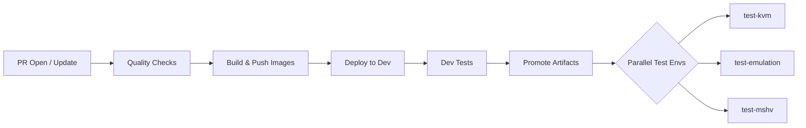

# L1HV CI/CD Infrastructure

## 1. High-Level Flow

## 2. Environments (GitHub Environments)
Each environment is a GitHub Environment holding secrets/vars for deploy & test.

| Environment | Purpose | Feature Gate L1HV | Test Scope | Compute | Hypervisor |
|-------------|---------|-------------------|------------|---------|-----------------|
| `dev` | Fast feedback for new feature coverage | ✓ | New L1HV tests only | [Azure VM dom0qemu](https://ms.portal.azure.com/#@fdpo.onmicrosoft.com/resource/subscriptions/7be1b9e7-57ca-47ff-b5ab-82e7ccb8c611/resourceGroups/kubevirt-dev-mshv-qemu-k3s-rg/providers/Microsoft.Compute/virtualMachines/kubevirt-dev-mshv-qemu-k3s-vm/overview) | MSHV |
| `test-mshv` | Full suite on Microsoft Hyper-V stack | ✓ | All e2e (existing + new) | [Azure VM dom0qemu](https://ms.portal.azure.com/#@fdpo.onmicrosoft.com/resource/subscriptions/7be1b9e7-57ca-47ff-b5ab-82e7ccb8c611/resourceGroups/kubevirt-test-mshv-vm-rg/providers/Microsoft.Compute/virtualMachines/kubevirt-test-mshv-vm-k3s/overview) | MSHV |
| `test-kvm` | Regression of existing stable e2e set |  | Existing e2e only | [AKS](https://ms.portal.azure.com/#@fdpo.onmicrosoft.com/resource/subscriptions/7be1b9e7-57ca-47ff-b5ab-82e7ccb8c611/resourceGroups/kubevirt-rg/providers/Microsoft.ContainerService/managedClusters/kubevirt-e2e-tests-aks/overview) | KVM |
| `test-emulation` | Full suite under emulation |  | All e2e (existing + new) | [Azure VM dom0qemu](https://ms.portal.azure.com/#@fdpo.onmicrosoft.com/resource/subscriptions/7be1b9e7-57ca-47ff-b5ab-82e7ccb8c611/resourceGroups/kubevirt-e2e-vm-rg/providers/Microsoft.Compute/virtualMachines/kubevirt-e2e-vm-k3s/overview) | QEMU Emulation |

## 3. Testing Matrix

|  | dev | test-mshv | test-kvm | test-emulation |
|-----------|-----|-----------|----------|----------------|
| New L1HV Tests | ✓ | ✓ |  | ✓  |
| Existing Stable e2e |  | ✓ | ✓ | ✓ |

Note! E2E tests on test-mshv environment are turned off now as the '/dev/mshv' support is not implemented yet.

## 4. Azure Resources

### 4.1 Compute

  - [Dev VM](https://ms.portal.azure.com/#@fdpo.onmicrosoft.com/resource/subscriptions/7be1b9e7-57ca-47ff-b5ab-82e7ccb8c611/resourceGroups/kubevirt-dev-mshv-qemu-k3s-rg/providers/Microsoft.Compute/virtualMachines/kubevirt-dev-mshv-qemu-k3s-vm/overview)
  - [E2E Test mshv VM](https://ms.portal.azure.com/#@fdpo.onmicrosoft.com/resource/subscriptions/7be1b9e7-57ca-47ff-b5ab-82e7ccb8c611/resourceGroups/kubevirt-test-mshv-vm-rg/providers/Microsoft.Compute/virtualMachines/kubevirt-test-mshv-vm-k3s/overview)
  - [E2E Test Emulation VM](https://ms.portal.azure.com/#@fdpo.onmicrosoft.com/resource/subscriptions/7be1b9e7-57ca-47ff-b5ab-82e7ccb8c611/resourceGroups/kubevirt-e2e-vm-rg/providers/Microsoft.Compute/virtualMachines/kubevirt-e2e-vm-k3s/overview)
  - [E2E Test KVM AKS](https://ms.portal.azure.com/#@fdpo.onmicrosoft.com/resource/subscriptions/7be1b9e7-57ca-47ff-b5ab-82e7ccb8c611/resourceGroups/kubevirt-rg/providers/Microsoft.ContainerService/managedClusters/kubevirt-e2e-tests-aks/overview)

### 4.2 Key Vault
  - [Key Vault with ssh keys and kubeconfigs](https://ms.portal.azure.com/#@fdpo.onmicrosoft.com/resource/subscriptions/7be1b9e7-57ca-47ff-b5ab-82e7ccb8c611/resourceGroups/kubevirt-rg/providers/Microsoft.KeyVault/vaults/kubevirtkv/overview)
  

### 4.3 GitHub Runners
  - [kubevirt-gh-actions-runner-1](https://ms.portal.azure.com/#@fdpo.onmicrosoft.com/resource/subscriptions/7be1b9e7-57ca-47ff-b5ab-82e7ccb8c611/resourceGroups/kubevirt-rg/providers/Microsoft.Compute/virtualMachines/kubevirt-gh-actions-runner-1/overview)
  - [kubevirt-gh-actions-runner-2](https://ms.portal.azure.com/#@fdpo.onmicrosoft.com/resource/subscriptions/7be1b9e7-57ca-47ff-b5ab-82e7ccb8c611/resourceGroups/kubevirt-rg/providers/Microsoft.Compute/virtualMachines/kubevirt-gh-actions-runner-2/overview)
  - [kubevirt-gh-actions-runner-3](https://ms.portal.azure.com/#@fdpo.onmicrosoft.com/resource/subscriptions/7be1b9e7-57ca-47ff-b5ab-82e7ccb8c611/resourceGroups/kubevirt-rg/providers/Microsoft.Compute/virtualMachines/kubevirt-gh-actions-runner-3/overview)    

