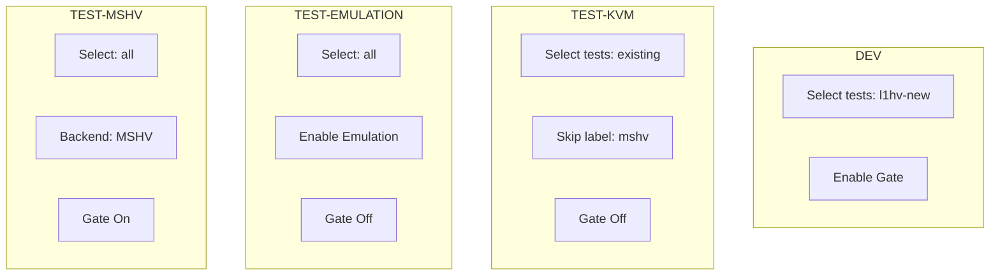

# L1HV CI/CD Infrastructure

> Concise documentation of the CI/CD pipeline, environments, feature gates, and test strategy for introducing the L1HV feature.

## 1. Purpose
Provide a clear view of how L1HV-related changes are validated through layered environments (Dev -> Test variants) with selective test execution to accelerate feedback while safeguarding stability.

## 2. High-Level Flow

```mermaid
graph LR
  A[PR Open / Update] --> B[Quality Checks (pr.yaml)]
  B --> C[Build & Push Images]
  C --> D[Deploy to Dev]
  D --> E[Run Dev Tests]\n(New L1HV only; Gate=On]
  E --> F[Promote Artifacts]
  F --> G{Parallel Test Environments}
  G --> H1[test-kvm]\n(Existing only; Gate=Off)
  G --> H2[test-emulation]\n(All e2e; Emulation; Gate=Off)
  G --> H3[test-mshv]\n(All e2e; MSHV; Gate=On)
  classDef gateOn fill=#dff6dd,stroke=#22863a,color=#044b1d;
  classDef gateOff fill=#f6f8fa,stroke=#666,color=#24292e;
  class E,H3 gateOn;
  class H1,H2 D gateOff;
```

Legend:
- Gate=On: L1HV FeatureGate enabled
- Gate=Off: L1HV FeatureGate disabled

## 3. Environments (GitHub Environments)
Each environment is a GitHub Environment holding secrets/vars for deploy & test.

| Environment | Purpose | Feature Gate L1HV | Test Scope | Hypervisor Mode |
|-------------|---------|-------------------|------------|-----------------|
| `dev` | Fast feedback for new feature coverage | Enabled | New L1HV tests only | Host default (KVM) |
| `test-kvm` | Regression of existing stable e2e set | Disabled | Existing e2e excluding `mshv`-labeled | KVM |
| `test-emulation` | Full logical coverage under emulation | Disabled | All e2e (existing + new) | QEMU Emulation |
| `test-mshv` | Full suite on Microsoft Hyper-V stack | Enabled | All e2e (existing + new) | MSHV |

> Note: If a variant named `test-lvm` was referenced earlier, it is assumed to be `test-kvm` (please adjust if different).

## 4. Test Selection Matrix

| Dimension | dev | test-kvm | test-emulation | test-mshv |
|-----------|-----|----------|----------------|-----------|
| L1HV Feature Gate | ON | OFF | OFF | ON |
| Hypervisor Backend | KVM | KVM | Emulation (QEMU SW) | MSHV |
| New L1HV Tests | YES | NO | YES (to validate under emu) | YES |
| Existing Stable e2e | NO | YES | YES | YES |
| Exclude `mshv`-labeled | N/A | YES | NO | NO |
| Emulation Mode Flag | OFF | OFF | ON | OFF |
| Goal | Fast signal on new feature | Regression protection | Broad functional parity | Hypervisor parity + feature validation |

### Label / Filter Reference (proposed)
| Purpose | Mechanism |
|---------|-----------|
| New L1HV tests | Label: `l1hv-new` or build tag/regex focus |
| Exclude MSHV-only from KVM regression | Label: `mshv` |
| Emulation mode activation | Env var / flag (e.g. `KUBEVIRT_EMULATION=true`) |
| Feature gate control | KubeVirt CR patch / deployment overlay |

## 5. Test Selection Logic (Visual)



## 6. Promotion & Artifacts
1. Images built once after Quality Checks pass.
2. Dev deployment uses same image digest as Test stages (immutability).
3. On successful Dev test run, same artifacts are promoted (no rebuild) to parallel test environments.
4. Each test environment publishes JUnit + logs (path: `_out/artifacts/...`).

## 7. Parallel Test Stage Orchestration


## 8. Failure Handling (Suggested)
| Stage | Action on Failure |
|-------|-------------------|
| Dev | Block promotion; annotate PR with failure summary |
| test-kvm | Mark regression risk; require review |
| test-emulation | Flag environment-specific issues |
| test-mshv | Flag hypervisor/feature-specific issues |

## 9. Future Enhancements
- Flake classification & auto-rerun for known flaky tests.
- Test focus/skip lists generated dynamically from labels.
- Dashboard aggregating pass rate per environment.
- Tighten artifact retention policies with pruning automation.
- Add mutation/fuzz tests gated behind opt-in label.

## 10. Quick Reference
| Item | Value |
|------|-------|
| Primary workflow file | `.github/workflows/pr.yaml` |
| Dev-only test focus | New L1HV labeled tests |
| Parallel environments | `test-kvm`, `test-emulation`, `test-mshv` |
| L1HV Gate Enabled In | `dev`, `test-mshv` |
| Artifact test report | `_out/artifacts/junit/junit.unittests.xml` |

---
_Last updated: 2025-09-15_
