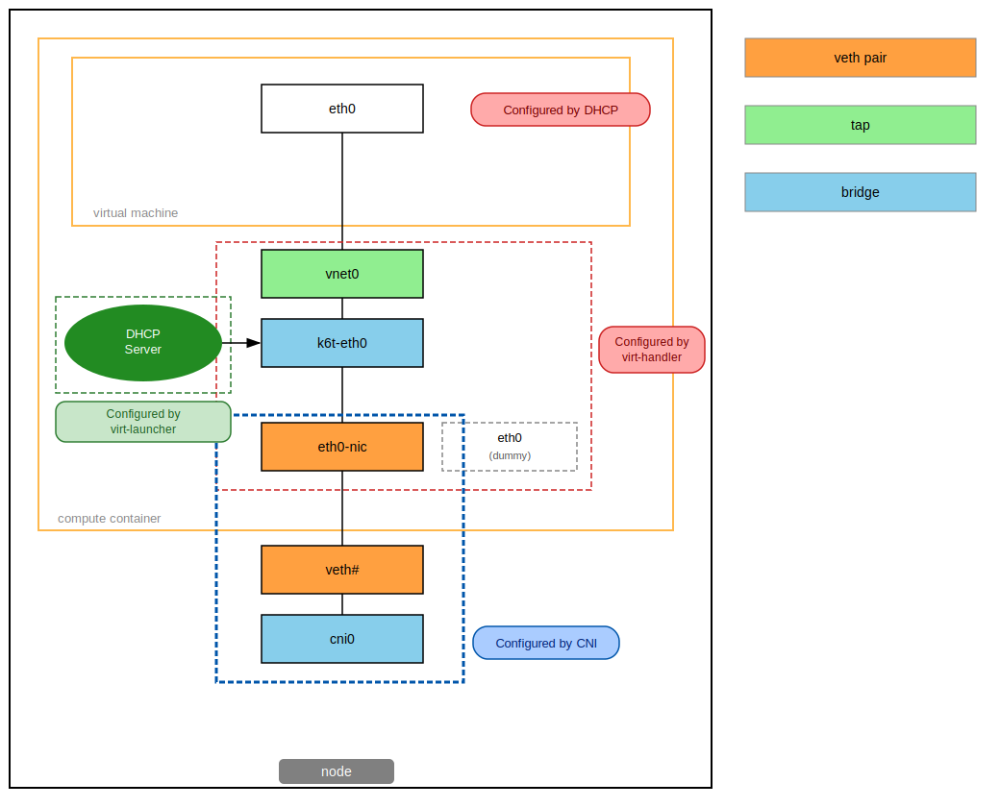

# VMI Networking
Before we explain how KubeVirt performs VM networking configuration, it is
paramount we separate the pod networking configuration and the  VM networking
configuration concepts. The underlying configuration of the pod network
interface is out of the scope of this document; Kubernetes is responsible to
set up pod networking according to its configuration, via [CNI](https://www.cni.dev/). It is safe to
assume it will simply plug a configured network interface into the pod, and
through it, the pod connects to the outside world.

The relevant part for KubeVirt is VM networking configuration, which will be
casually referred to as `binding` throughout this developer's guide.

## VMI networking configuration
In this section we'll explain how VM networking is configured. In order to
follow the principle of least privilege (where each component is limited
to only its required privileges), the configuration of a KubeVirt VM interfaces
is split into two distinct phases:
- [privileged networking configuration](#privileged-vmi-networking-configuration): occurs in the virt-handler process
- [unprivileged networking configuration](#unprivileged-vmi-networking-configuration): occurs in the virt-launcher process

### Privileged VMI networking configuration
Virt-handler is a trusted component of KubeVirt; it runs on a privileged
daemonset. It is responsible for creating & configuring any required network
infrastructure (or configuration) required by the
[binding mechanisms](#binding-mechanisms).

It is important to refer that while this step is performed by virt-handler, it
is performed in the *target* virt-launcher's net namespace.

The first action done in the privileged VMI networking configuration is to
identify the correct [binding mechanism](#binding-mechanisms) to use.
Once identified, the following operations are performed, in this order:

1. Discover the pod network interface: gather information about the pod
   interface required by the binding mechanism. The gathered information
   includes:
   - IP address
   - Routes (**only** bridge)
   - Gateway (**only** bridge)
   - MAC address (**only** bridge)
   - Link MTU

2. Persist the interface state to the file system:
   - Pod interface cache: records the interface state for virt-handler state
     tracking (applies to all bindings).
   - DHCP interface cache: stores the interface configuration for the in-pod
     DHCP server (applies to bridge binding only).

3. Prepare the pod network interfaces: use the information gathered above to
   perform actions specific to each binding mechanism.
   See each binding mechanism section for more details.

### Unprivileged VMI networking configuration
The virt-launcher is an untrusted component of KubeVirt (since it wraps the
libvirt process that will run third party workloads). As a result, it must be
run with as little privileges as required. The only networking-related
capability required by virt-launcher is `CAP_NET_BIND_SERVICE`, which allows
the in-pod DHCP server to bind to a privileged port.

In this second phase, virt-launcher generates the VM's domain configuration
based on the selected binding mechanism and interface information read from
netlink. For bridge binding, it additionally starts an in-pod DHCP server
using the configuration written by virt-handler in phase 1.

The domain configuration is specific to each
[binding mechanism](#binding-mechanisms), as each leads to a different
hypervisor configuration.

## Binding Mechanisms
A binding mechanism specifies how to wire the VM network interface to the pod
network interface. It sets up the required networking infrastructure and
generates the hypervisor configuration.

Each interface type has a different binding mechanism, since it leads to a
different hypervisor configuration and may require different networking
infrastructure to be created — e.g. a bridge for the `bridge` or `masquerade`
binding mechanisms.

The existing binding mechanisms are:
- [bridge](#bridge-binding-mechanism)
- [masquerade](#masquerade-binding-mechanism)

### Bridge binding mechanism
Using the bridge binding requires a VMI configuration featuring a
network whose interface type is `bridge` - the yaml file below can be used
as reference, but please refer to the
[user guide](https://kubevirt.io/user-guide/#/creation/interfaces-and-networks?id=bridge)
for more information.
```yaml
kind: VM
spec:
  domain:
    devices:
      interfaces:
        - name: default
          bridge: {}
  networks:
  - name: default
    pod: {} # Stock pod network
```

Let's refer to the image below to get a better understanding of how this
binding mechanism works.

Bridge binding mechanism diagram



As can be seen in the diagram above, there are three actors at play: CNI,
libvirt, and DHCP. For completeness sake, let's add one more actor that is
implicit in the picture: KubeVirt.

As indicated in [the introduction](#vmi-networking), the pod networking
configuration step - performed by CNI - is out of scope of this guide. The
focus will be instead on how KubeVirt performs bridge binding.

The bridge binding starts by reading the pod networking interface configured by
CNI. It records the assigned MAC address, MTU, IP address(es), and routes.

In phase 1, KubeVirt creates an in-pod bridge and renames the pod networking
interface (e.g. `eth0` → `eth0-nic`), attaching the renamed interface as a
bridge port. Its MAC address is replaced and its IP addresses are removed.

To preserve the original network identity, a dummy interface is created under
the original pod interface name (e.g. `eth0`). It holds the original MAC
address, IP address(es), MTU, and routes. This allows the container runtime
to continue answering CNI CHECK commands at runtime: since the IP has been
moved to the guest and removed from the renamed pod interface, the dummy
retains it so CNI can still verify the pod's network configuration is intact.

In phase 2 (executed by virt-launcher, unprivileged) the VM's domain
configuration is generated.

> **libvirt/QEMU specific:** The following domain XML example applies to the
> libvirt/QEMU hypervisor. Other hypervisors may represent this configuration
> differently.

```xml
<interface type='ethernet'>
    <target dev='tap0' managed='no'/>
    <model type='virtio'/>
    <mac address='8a:37:e9:71:f2:a4'/>
    <mtu size='1450'/>
    <alias name='ua-default'/>
</interface>
```

Once the VM is booted, libvirt consumes the interface XML definition and
connects to the tap device — named after the `target` parameter — which was
created by virt-handler in phase 1 and is already attached to the in-pod
bridge.

Finally, and depending if the pod networking interface had configured IP
address(es), an in-pod DHCP server will be created to advertise the IP address
and routes captured from the pod interface. This last step effectively
carries over the pod interface configuration to the VM interface, transparently
to the user. 

When the pod networking interface does not feature an IP address, the in-pod
DHCP server will not be started, leaving the VM with plain L2 connection via
the in-pod bridge.

### Masquerade binding mechanism
Similar to the [bridge binding mechanism](#bridge-binding-mechanism), triggering
the masquerade binding requires a VMI configuration featuring a
network with the `masquerade` interface type. KubeVirt provides an example of
a
[fedora based VMI](https://github.com/kubevirt/kubevirt/blob/main/examples/vmi-masquerade.yaml)
in the project's examples folder.

The masquerade binding mechanism has plenty in common with bridge binding; both
have virt-handler create an in-pod bridge and generate a hypervisor interface
definition to connect the VM to it. Both phases communicate by caching
interface state between phase 1 and phase 2.

However, the similarities end there; while the networking infrastructure is
the same, VM networking works completely different.

In masquerade binding, the goal is to NAT the traffic from the pod interface
into the VM interface via NFtables. Before venturing into details,
the relevant knobs should be described.

There are 2 knobs that impact the configuration of the masquerade binding:
  - `ports`: an attribute of the interface, described in the
    `spec::domain::interfaces` subtree. Here the user indicates the allowlist
     of ports and protocols. It is important to mention that when the list is
     omitted, **all** ports are implicitly included.
  - `vmNetworkCIDR`: the CIDR from which the in-pod bridge **and** the VM will
    get their IP address. This attribute is defined in the `spec::networks`
    subtree. It defaults to `10.0.2.0/24`.

Please refer to the short example below to visualize the aforementioned knobs:
```yaml
...
spec:
  domain:
    devices:
      ...
      interfaces:
      - masquerade: {}
        name: masqueradenet
        ports:
        - name: http
          port: 80
          protocol: TCP
  networks:
  - name: masqueradenet
    pod:
      vmNetworkCIDR: 10.11.12.0/24
```

As with bridge binding, masquerade binding caches the MTU of the pod
networking interface. It also assigns an IP address from the configured CIDR
(or the default), and reserves an IP for the gateway — which will be the
in-pod bridge. Re-using the example above, we would have `10.11.12.1` as
gateway IP, and `10.11.12.2` as VM IP.

In phase 1, the bridge is configured with the IP address reserved for the
VM's gateway. The bridge acts as the VM's default gateway and not as an L2
bridge; therefore, the pod networking interface is not set as its port.

Afterwards, the nftables rules are provisioned in the NAT table. It
follows a standard one to one NAT implementation using netfilter.

It first involves the `prerouting` chain, which is responsible for packets that
have just arrived at the network interface. This rule simply filters all
incoming traffic from the pod networking interface, making it go through the
`KUBEVIRT_PREINBOUND` chain.

```
chain prerouting {
		iifname "eth0" counter jump KUBEVIRT_PREINBOUND
}
```

On the `KUBEVIRT_PREINBOUND` chain, packets will be DNAT'ed (have their
destination address changed) to the IP address of the VM - e.g. `10.11.12.2`.
This can be subject to an allowlist of ports (if one was provided by the user,
in the masquerade interface specification) or simply have all ports accepted -
when the port configuration is omitted.

```
chain KUBEVIRT_PREINBOUND {
		counter dnat to 10.11.12.2
}
```

Before the packet leaves the interface, it will pass through the
`postrouting` chain, which in turn, makes the packet go through the
`KUBEVIRT_POSTINBOUND` chain.

```
chain postrouting {
	oifname "k6t-eth0" counter jump KUBEVIRT_POSTINBOUND
}
```

In the `KUBEVIRT_POSTINBOUND` chain, in case the source address is localhost, SNAT is
performed: the source IP address of the outbound packet is modified to the IP address of
the gateway - `10.11.12.1`.

```
chain KUBEVIRT_POSTINBOUND {
		ip saddr { 127.0.0.1 } counter snat to 10.11.12.1
}
```

Once the packet leaves the interface, it will be subject to the routing tables
present on the virt-launcher pod. Since we've DNAT'ed the packet, it will be
routed to the in-pod bridge, which will forward the traffic to the VM.

All outbound traffic from the VM can reach the outside world via the in-pod
bridge. The packet will be routed via the default route -
`default via 169.254.1.1 dev eth0` - and before leaving the interface, its
source address will be masqueraded to the IP address of the pod, via the
masquerade target.

```
chain postrouting {
	ip saddr 10.11.12.2 counter masquerade
}
```

### Masquerade binding using IPv6 addresses
The masquerade binding mechanism is currently the only binding mechanism which
accepts IPv6 addresses.

It operates in exactly the same way as in IPv4, and follows the same goals:
configure one to one NAT. As in it's IPv4 counter-part, the pods are reached
via their IPv6 pod addresses.

NAT is configured in the exact same way, but using ip6tables, or the `ipv6-nat`
nftable table. Please refer to the tables below to visualize how NAT for IPv6
addresses is accomplished in KubeVirt.

```
table ip6 nat {
	chain prerouting {
		iifname "eth0" counter jump KUBEVIRT_PREINBOUND
	}

	chain output {
		ip6 daddr { ::1 } counter dnat to fd10:0:2::2
	}

	chain postrouting {
		ip6 saddr fd10:0:2::2 counter masquerade
		oifname "k6t-eth0" counter jump KUBEVIRT_POSTINBOUND
	}

	chain KUBEVIRT_PREINBOUND {
		counter dnat to fd10:0:2::2
	}

	chain KUBEVIRT_POSTINBOUND {
		ip6 saddr { ::1 } counter snat to fd10:0:2::1
	}
}
```

It is important to refer that masquerade binding configures NAT for both IPv4
and IPv6 address families - both address family traffic is forwarded into the
VM instance. Despite that, the only IP address reported is the IPv6 address,
which implicitly highly encourages IPv6 communication towards the VM instance.

On a final note, there is a difference that impacts the user experience when
using masquerade binding for IPv6 addresses; the VMI IP must be [manually
configured by the user](https://kubevirt.io/user-guide/virtual_machines/interfaces_and_networks/#masquerade-ipv4-and-ipv6-dual-stack-support).
