### Benchmarks

This document shares some of the performance benchmarks observed as part of the v1.8.0 release.
It will talk about what this means for an end-user's perf and scale story.

#### Background: How to interpret the numbers?

KubeVirt is an extension for Kubernetes that includes a collection of custom resource definitions
(CRDs) served by kubevirt-apiserver. These CRDs are managed by controllers. Due to the distributed
nature of the system, understanding performance and scalability data becomes challenging without
taking specific assumptions into account. This section aims to provide clarity on those assumptions.

1. The data presented in the document was collected from `periodic-kubevirt-e2e-k8s-1.31-sig-performance` and after October 16, 2025, data was collected from `periodic-kubevirt-e2e-k8s-1.34-sig-performance`
1. The test suite includes three tests:
   1. It creates 100 minimal VMIs, with a small pause of 100 ms between creation of 2 VMIs. The definition
      of minimal VMIs can be found [here](https://github.com/kubevirt/kubevirt/blob/20f6caaba4108733a2c3f216e3247202929c1ef9/tests/performance/density.go#L273).
      This is represented in the graphs as <Metric> for VMI, for example `vmiCreationToRunningSecondsP50` for VMI
   2. It creates 100 minimal VMs, with a small pause of 100 ms between creation of 2 VMIs. The definition
      of minimal VMs created can be found [here](https://github.com/kubevirt/kubevirt/blob/20f6caaba4108733a2c3f216e3247202929c1ef9/tests/performance/density.go#L219C1-L219C1).
      This is represented in the graphs as <Metric> for VM, for example `vmiCreationToRunningSecondsP50` for VM
   3. It creates VMs with instancetype and preference, the definition can be found [here](https://github.com/kubevirt/kubevirt/blob/20f6caaba4108733a2c3f216e3247202929c1ef9/tests/performance/density.go#L203).
      The benchmarks for this will be added in future releases.
1. The test waits for the VMIs to go into running state and collects a bunch of metrics
1. The collected metrics are categorized into two buckets, performance and scale
   1. Performance Metrics: This tells users how KubeVirt stack is performing. Examples include
      `vmiCreationToRunningSecondsP50` and `vmiCreationToRunningSecondsP95`. This helps users understand how KubeVirt 
       performance evolved over the releases; depending on the user deployment, the numbers will vary, because a real
       production workload could use other KubeVirt extension points like the device plugins, custom scheduler, 
       different version of kubelet etc. These numbers are just a guidance for how the KubeVirt codebase is performing 
       with minimal VMIs, provided all other variables(hardware, kubernetes version, cluster-size etc) remain the same.
   1. Scalability metrics: This helps users understand the KubeVirt scaling behaviors. Examples include, 
      `PATCH-pods-count` for VMI, `PATCH-virtualmachineinstances-count` for VMI and `UPDATE-virtualmachineinstances-count`
      for VMI. These metrics are measured on the client side to understand the load generated to apiserver by the 
      KubeVirt stack. This will help users and developers understand the cost of new features going into KubeVirt. It
      will also make end-users aware about the most expensive calls coming from KubeVirt in their deployment and 
      potentially act on it.  
1. The grey dotted line in the graph is March 25, 2025, denoting release of v1.5.0.
1. The orange dotted line in the graph is April 23, 2025, denoting change in k8s provider to v1.33.
1. The blue dotted line in the graph is July 30, 2025, denoting release of v1.6.0.
1. The yellow dotted line in the graph is August 27, 2025, denoting change in k8s provider to v1.34.
1. The green dotted line in the graph is November 27, 2025, denoting release of v1.7.0.
1. The red dotted line in the graph is December 17, 2025, denoting change in k8s provider to v1.35.
1. The purple dotted line in the graph is March 25, 2026, denoting release of v1.8.0.

#### Performance benchmarks for v1.8.0 release

#### vmiCreationToRunningSecondsP50

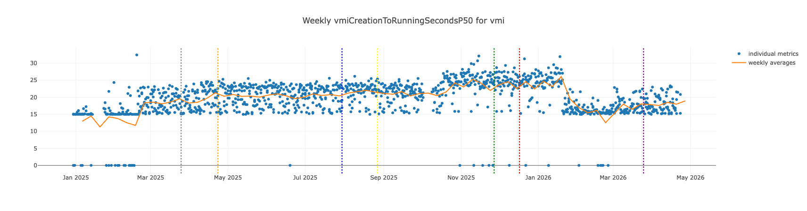

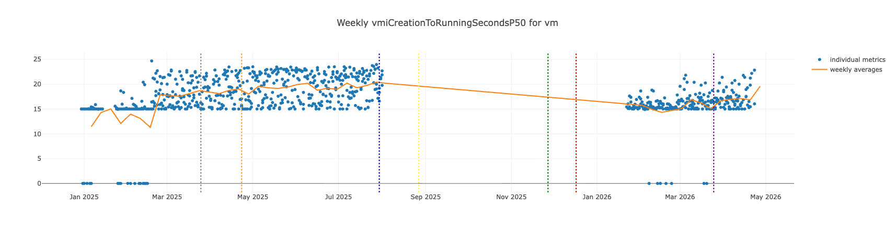

#### vmiCreationToRunningSecondsP95

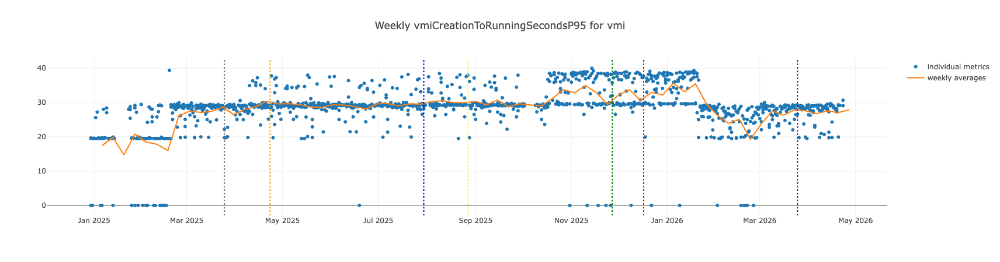

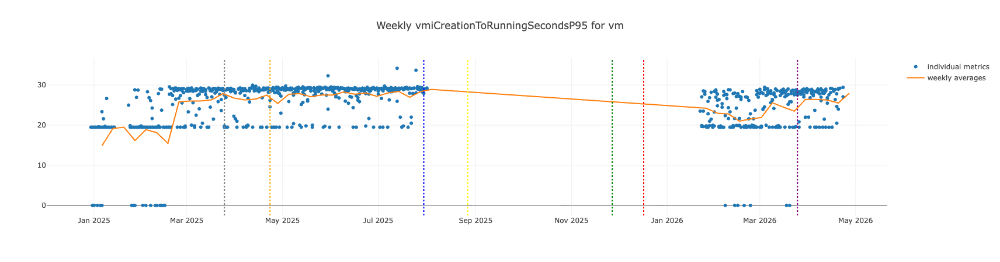

#### CPU and Memory usage of virt-api, virt-controller and virt-handler 

#### avgVirtAPICPUUsage

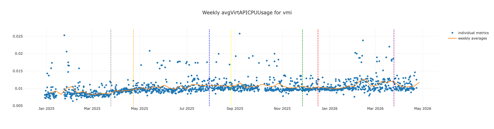

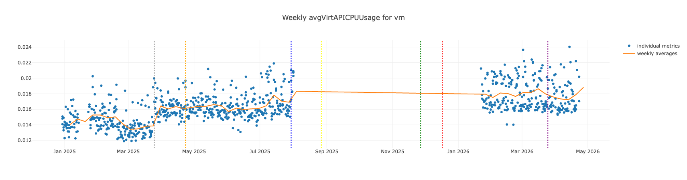

#### avgVirtControllerCPUUsage

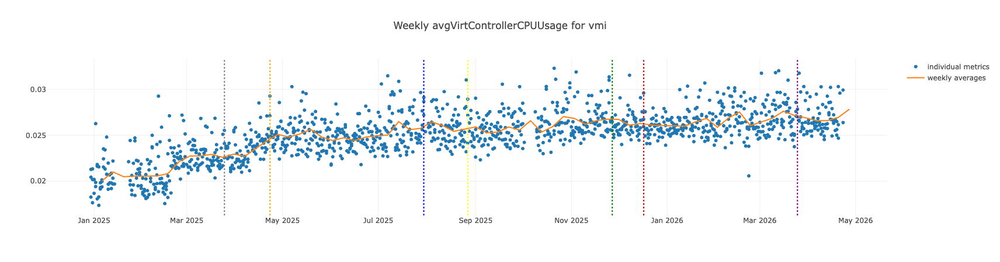

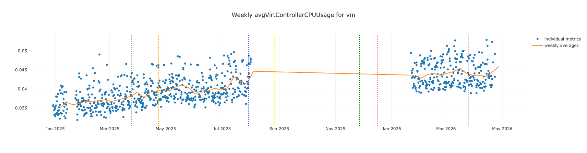

#### avgVirtAPIMemoryUsageInMB

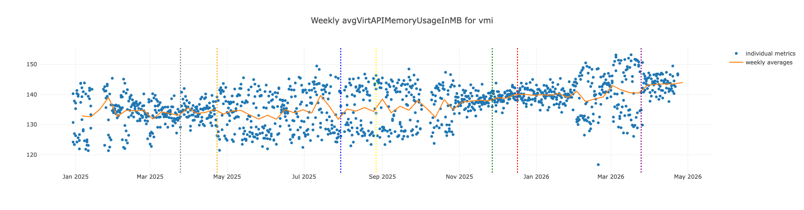

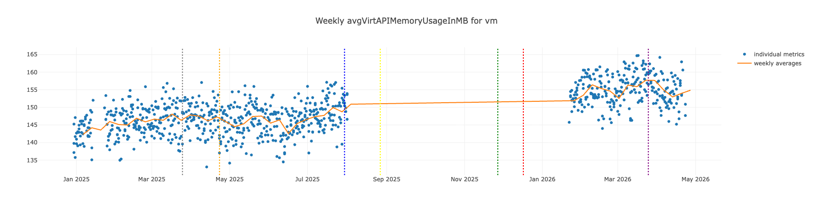

#### avgVirtControllerMemoryUsageInMB

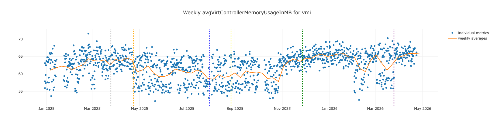

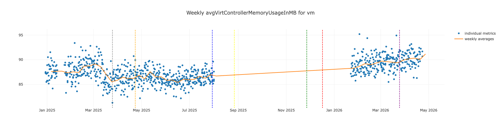

#### avgVirtHandlerCPUUsage

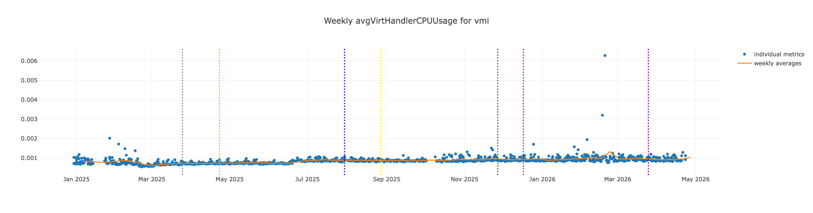

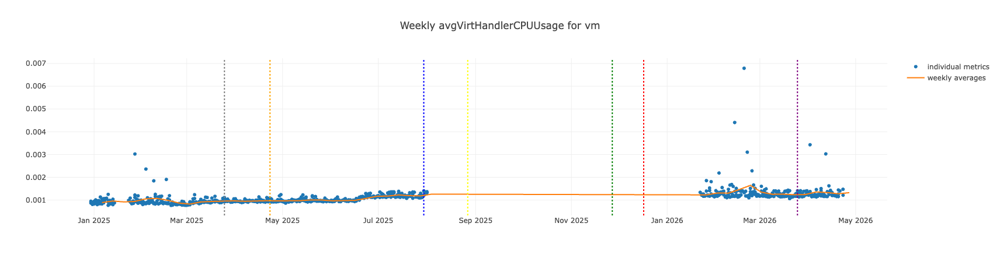

#### avgVirtHandlerMemoryUsageInMB

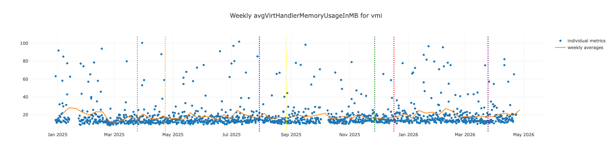

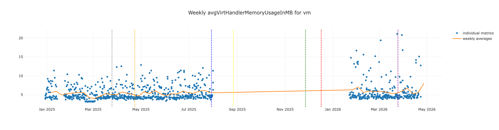

#### Scalability benchmarks for v1.8.0 release

#### PATCH-pods-count

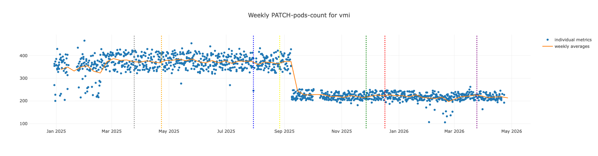

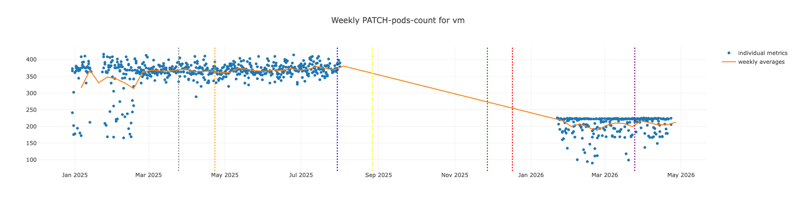

#### UPDATE-vmis-count

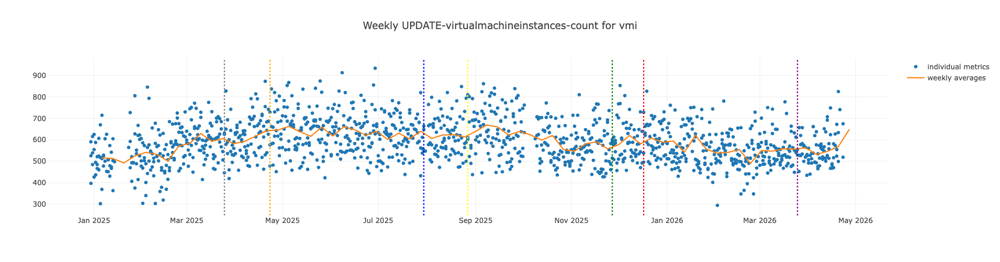

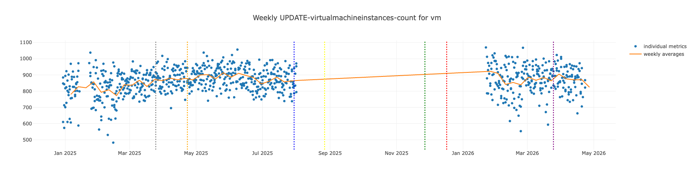

#### PATCH-vmis-count

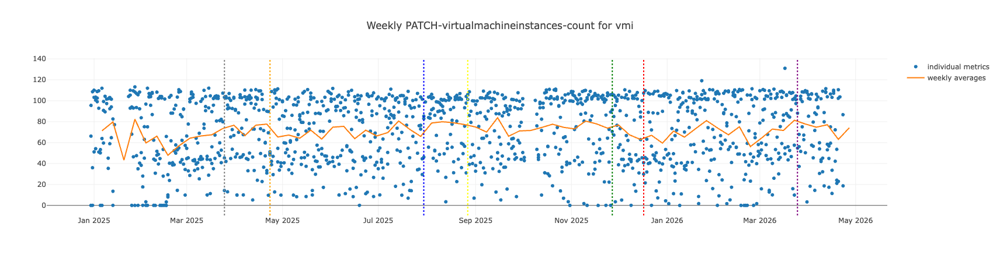

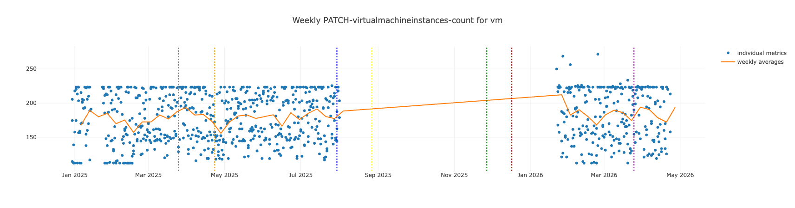

#### PATCH-nodes-count

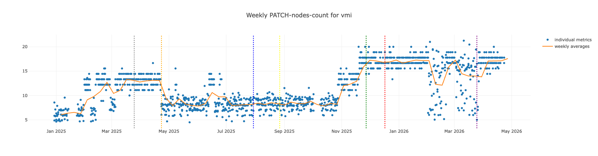

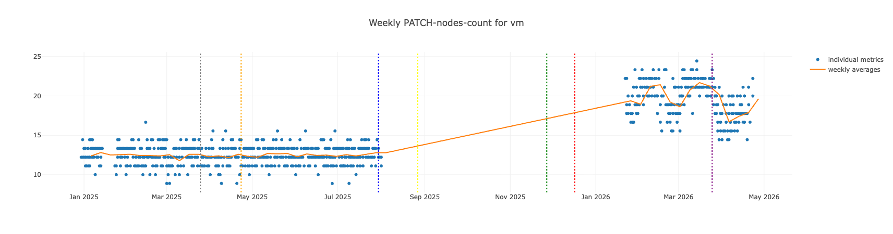

#### GET-nodes-count

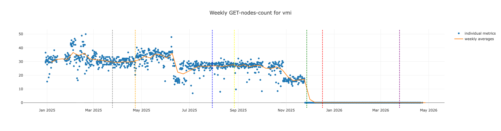

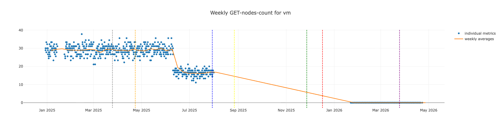

#### WATCH-virtualmachineinstances-count

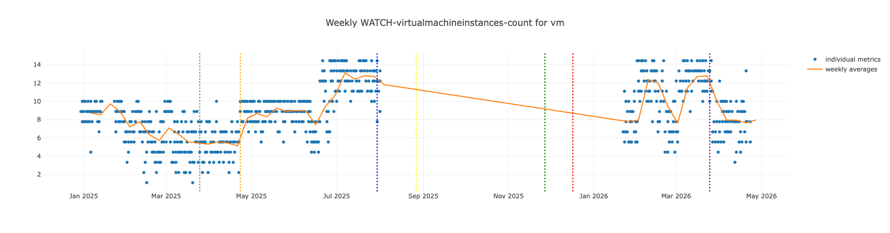

#### Note : 
VM metrics between August 2025 and December 2025 because artifacts are uploaded in a wrong path, The path was corrected in https://github.com/kubevirt/project-infra/pull/4670 
