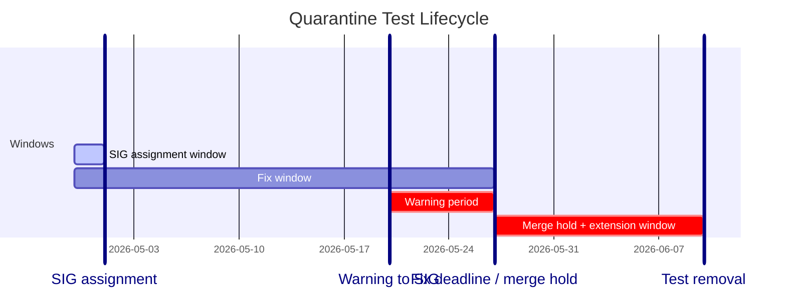

# Test Quarantine

The execution of tests on CI should be as deterministic as possible, besides
potential issues coming from infrastructure or external dependencies. When a
test sometimes fails and sometimes passes, apparently randomly, without any
relationship with the changes in a PR, it has very negative implications:
* The results of the whole suite are less valuable, we can no longer trust
the information given by the suite execution. Changes are added to the codebase
without actually knowing if they are going to break something.
* As a consequence, we can't be completely sure about the state of the product
at release time, it can be ok or not.
* The development process is affected negatively. Developers need to wait
until a lucky execution aligns all the required tests in green, which can take
more than a week in some cases.

In summary, the CI system stops helping the product evolution and instead becomes
an obstacle.

We have introduced a quarantine methodology to put apart the tests that don't
behave deterministically until they are fixed, so that we can keep the rest of
the suite as healthy as possible. You can read more about test quarantine
methodology in [1] and [2], and about an actual implementation in [3].

## Goal

The purpose of applying the methodology described in this document is increasing
the stability of the CI suite. We consider the CI stable if the whole test suite
has a failure rate below 10%.

We need to multiplicate the individual failure rates to obtain the whole suite
passing rate, this means that with a failure rate of 5% per individual test, more
than 2 flaky tests would  lead to an overall test suite failure rate above the 10%
goal (0.95 ** 2 = 0.9025). And, for instance, 17 failing tests with 5% failure rate
would lead to a terrible 41.81% passing rate of the whole suite (0.95 ** 17 = 0.4181).

## Procedure

In order to remove as much as possible the influence of changes in PRs to
determine the stability of the suite, we will take into account only results
from the periodics that run e2e tests from main (hence jobs can be checked
[on testgrid]) and presubmits that are executed on merged code (on tide merge
batches as reported by flakefinder).

We will consider test failures only in jobs where less than 5 tests failed, so
that we don't take into account systemic failures caused for instance by an
infrastructure problem.

### Lifecycle

Once a quarantine PR is merged, the following timeline applies:

| Milestone              | Deadline                                 | Action                                                                   |
|------------------------|------------------------------------------|--------------------------------------------------------------------------|
| SIG assignment         | 2 days from merge                        | SIG chair ensures a dedicated owner is assigned within 2 days            |
| Warning                | 3 weeks from merge                       | SIG is notified that the fix deadline expires in 1 week                  |
| Fix deadline           | 4 weeks from merge                       | Fix must land; if not, a merge hold begins (see [escalation](#enforcement-escalation)) |
| Extension (optional)   | Up to 2 weeks after fix deadline         | Assignee must request with a concrete plan                               |
| Test removal           | 6 weeks from merge (or end of extension) | sig-ci opens a PR to remove the test (see [removal options](#test-removal-options)) |

These deadlines apply to all quarantined tests, including release blockers.

#### Example timeline




### Putting tests in quarantine

A test must be put in quarantine when any of these conditions is met:
* It has a failure rate higher than 5% in the last two weeks.
* It has a failure rate higher than 20% in the last 3 days.

#### Automatic quarantine

The [`periodic-kubevirt-auto-quarantine`] job runs **hourly** and automatically
creates quarantine PRs for the flakiest test(s) that meet the above criteria.
Each run quarantines at most one test.

The job:
1. Aggregates flake statistics from periodic job results over the last 14 days.
2. Cross-references failures with [search.ci] data, filtering out rehearsals,
   flake-check runs, de-quarantine runs, and clustered failures.
3. Identifies the test source file via a Ginkgo dry-run and modifies it to add
   `[QUARANTINE]` and the `decorators.Quarantine` decorator.
4. Creates a PR from the `kubevirt-bot` fork with the `approved`,
   `kind/auto-quarantine`, `kind/flake`, and `priority/critical-urgent` labels,
   plus `/sig {compute,network,storage,operator}` based on the test's SIG label.

Auto-quarantine PRs can be identified by the **`kind/auto-quarantine`** label.
If a PR already exists on the `auto-quarantine` branch with `lgtm`, `approved`,
or `do-not-merge/hold`, the job skips creating a new one.

[`periodic-kubevirt-auto-quarantine`]: https://github.com/kubevirt/project-infra/blob/main/github/ci/prow-deploy/files/jobs/kubevirt/kubevirt/kubevirt-periodics.yaml
[search.ci]: https://search.ci.kubevirt.io/

#### Manual quarantine PR

A quarantine PR can also be proposed manually at any time. The PR must add the
text `[QUARANTINE]` and the `decorators.Quarantine`
[labelDecorator](https://github.com/kubevirt/kubevirt/blob/9a3799f7a0b97b70033e119c0b401778c51dee14/tests/decorators/decorators.go#L5)
to each test's description in the code.

#### Grace period

After a quarantine PR (automatic or manual) is proposed, there is a grace period
of 2 days to prepare and land a fix for a test in the batch. If at least 5
consecutive executions with the fix pass the test can be removed from the batch.

#### Quarantined test owners

Each quarantined test must have a team owner. The PR will add the text
`[sig-{compute,network,storage,operator}]` to each test's description and
the proper label decorator.

#### Tracking issues

Every quarantined test must have a corresponding GitHub issue. The quarantine
PR must reference the tracking issue. The tracking issue must include:

* Labels: `kind/flake`, `priority/critical-urgent`, and the owning SIG label
  (e.g. `sig/compute`)
* Quarantine entry date (date the quarantine PR was merged)
* The SIG chair is responsible for ensuring the tracking issue has an assigned
  owner within 2 days; the chair may assign any SIG member (including
  themselves) as the dedicated owner
* The assignee decides whether to fix or remove the test within the fix window
  (see [removal options](#test-removal-options))
* The quarantine deadline (6 weeks from entry date)

The owning SIG must provide a status update on the tracking issue every 2 weeks.
If no update is provided, sig-ci will ping the SIG chair on the issue.

The tracking issue body should follow this template:

```yaml
---
quarantine:
  test_name: "<full test name including SIG prefix>"
  quarantine_pr: "<PR URL>"
  entry_date: "<date the quarantine PR was merged>"
  deadline: "<6 weeks from entry date>"
  owning_sig: "<e.g. sig-compute, sig-network — see [sigs.yaml]>"
  assigned_owner: "<GitHub handle>"
  plan: "<fix | remove>"
---
```

#### Quarantining release blockers

When a test marked with the [release-blocker] meets the conditions to be
quarantined we will:
* Create github issue with a comment `/release-blocker main` to ensure that
the issue is addressed before a new release is cut.
* Ensure that the github issue is assigned to an individual who will own bringing
the blocker to completion within a quick time frame.

### Getting tests out of quarantine

A member of the team assigned to each quarantined tests should propose a fix for
the test or, after investigating the source of the errors, determine that the
test itself doesn't need changes to be fixed (maybe the fix needs to be done on
other parts of the code base or in a separate repo). In any case, the team
assigned must communicate when the test is expected to be stable.

A test is eligible for de-quarantining once it demonstrates a failure rate of 0.1% or less.

If the SIG believes the flakyness is resolved they can trigger the pull-kubevirt-check-dequarantine-test job by
commenting /test pull-kubevirt-check-dequarantine-test[^1] directly on the dequarantine pull request.

If the periodic test runs confirm the failure rate meets the above criteria the SIG can open a dequarantine PR.

[^1]: The lane
  [`pull-kubevirt-check-dequarantine-test`](https://github.com/kubevirt/project-infra/blob/a4eeae570d8c2eabbde7286c663972ad09002571/github/ci/prow-deploy/files/jobs/kubevirt/kubevirt/kubevirt-presubmits.yaml#L369)
  has the goal of speeding up the process in showing the stability of a test by
  executing the test repeatedly.
  It leverages the technique from the `pull-kubevirt-check-tests-for-flakes`
  lane that determines the changed test from available changeset data in the
  pull request.

Quarantined tests satisfying the criteria will be ready to join the stable suite
again. A member of the team assigned to each
quarantined test will propose a PR to remove the text `[QUARANTINE]` and the
label decorator from the test description in the code.
After merging this PR the test will be out of quarantine.

#### Fix deadline

The owning SIG has 4 weeks from the date the quarantine PR is merged to provide
a fix. The fix must bring the test's failure rate to 0.1% or less, as described
above.

At the 3-week mark, the owning SIG will be notified that the fix deadline
expires in 1 week.

#### Extension

The assignee may request a one-time extension of up to 2 weeks by updating
the tracking issue before the fix deadline. The extension must include a
concrete plan for resolution. If the extension expires without a fix, sig-ci
proceeds with test removal.

The extension request should follow this template (posted as a comment on the
tracking issue):

```yaml
---
extension_request:
  requested_duration: "<1–2 weeks>"
  root_cause_status: "<identified | under investigation>"
  fix_approach: "<brief description of the planned fix>"
  expected_fix_pr: "<date or 'within N days'>"
  remaining_blockers: "<any dependencies or open questions>"
---
```

#### Enforcement escalation

Before test removal, sig-ci may apply graduated enforcement:

1. **Warning** (3 weeks): SIG is notified the fix deadline is approaching.
2. **Merge hold** (4 weeks, if no fix): New feature and refactoring PRs from
   the owning SIG are held from merging until the flaky test is resolved.
   Bug fixes and test fixes are exempt. This mirrors the existing
   [test lane quarantine](#test-lane-quarantine) policy.
3. **Test removal** (6 weeks, or after extension): sig-ci opens a removal PR
   (see [removal options](#test-removal-options)).

#### Test removal options

When a quarantined test reaches its deadline without a fix, the owning SIG
decides how to remove it. There are two valid approaches:

* **Deletion**: Remove the test entirely. The tracking issue remains open to
  ensure the test is re-added when the underlying problem is fixed. This is
  appropriate when there is no hard commitment to fix the underlying issue
  or when the tested behavior is not currently guaranteed.
* **`PEntry` (Pending)**: Convert the test entry to `PEntry` so it remains
  in the codebase but does not execute. This signals that the feature is still
  expected to work and the test should be re-enabled once the fix lands. This
  is appropriate when there is a concrete plan to fix the underlying issue.

The owning SIG has the final say on which approach to use. In either case, the
tracking issue must remain open until the test is restored or explicitly closed.

If the owning SIG does not express a preference before the deadline, sig-ci
will default to deletion with the tracking issue kept open.

#### Test expiration

If no fix has been provided within the deadline (including any granted
extension), sig-ci will open a PR to remove the test and ensure it is merged.
A quarantined test that cannot be stabilized within this window is not providing
value to the suite and should be removed.

This policy applies equally to all quarantined tests, including those marked
as release blockers.

# The `NoFlakeCheck` Decorator

The `decorators.NoFlakeCheck` decorator excludes a test from the
[`pull-kubevirt-check-tests-for-flakes`] presubmit lane. It exists for tests
that **cannot run** on the flake-check lane due to infrastructure constraints —
for example, tests that require storage classes, hardware features, or cluster
topologies that the flake-check environment does not provide.

## When to use `NoFlakeCheck`

Apply `NoFlakeCheck` only when the flake-check lane lacks the infrastructure a
test requires. Common legitimate reasons include:

* The test needs a storage class (e.g. RWX filesystem, VM state storage) that
  is not provisioned on the flake-check cluster.
* The test requires special hardware (GPU, SRIOV, SEV) that the flake-check
  nodes do not have.
* The test depends on a multi-node topology that the flake-check environment
  cannot satisfy.

## When NOT to use `NoFlakeCheck`

**This decorator must not be used on tests that are flaky.** If a test fails
intermittently, it must be [quarantined](#putting-tests-in-quarantine) instead.
Misusing `NoFlakeCheck` to hide flakes undermines CI stability for everyone.

## Requirements when applying the decorator

1. **Document the reason.** The commit message (or an inline code comment next
   to the decorator) must explain why the test is incompatible with the
   flake-check lane.
2. **Treat it as temporary.** The long-term goal is to maximize test coverage
   on the flake-check lane. When the lane infrastructure is extended to support
   the test, the decorator should be removed.
3. **Consider a flake-check clone.** Where possible, create a simplified
   variant of the test decorated with `decorators.FlakeCheck` that can run on
   the flake-check lane, so that at least part of the functionality is covered.

For background on this policy see the [kubevirt-dev mailing list discussion].

[`pull-kubevirt-check-tests-for-flakes`]: https://github.com/kubevirt/project-infra/blob/e2fa3f46cb8acbaa4657cdc18a823a0665acbaff/github/ci/prow-deploy/files/jobs/kubevirt/kubevirt/kubevirt-presubmits.yaml#L325
[kubevirt-dev mailing list discussion]: https://groups.google.com/g/kubevirt-dev/c/7z5TXJwmcrs

# Test Lane Quarantine

There can be cases where required test lanes are flaking in a clustered manner with a large
number of tests failing each time. This can cause major delays to merging important pull
requests and overload CI. Individual test case quarantining does not make sense in this case.

A required test lane should be made optional if the following criteria are met:
* The required test lane has a failure rate higher than 25% in the last 7 days
* More than ten individual test cases are causing the required test lane to fail
* The SIG responsible for the required test lane is unable to deliver a fix for the
flake within 7 days

The percentage impact of a flaky test lane can be measured by searching for a relevant
error on the [CI search page](https://search.ci.kubevirt.io/).
The failure rate of a test lane can be checked by going to the 
[top failed lane list](https://github.com/kubevirt/ci-health?tab=readme-ov-file#failures-per-sig-against-last-code-push-for-merged-prs) in the ci-health repository.

Following a required test lane being made optional a number of actions must happen:
* Create github issue with a comment `/release-blocker main` to ensure that
the issue is addressed before a new release is cut.
* Ensure that the github issue is assigned to a member of the responsible SIG who
will own bringing the blocker to completion within a quick time frame.
* The SIG should stop all feature and refactoring work until a fix for the flake
has been identified and a pull request has been created. If the quarantined test lane is 
not receiving the required attention from the responsible SIG, SIG CI can take a 
decision to hold merge queue PRs from the responsible SIG that are not related to a fix.
* Once the fix is merged and the test lane returns to an acceptable failure
rate, the test lane should be set back to required as soon as possible


[1]: https://martinfowler.com/articles/nonDeterminism.html#Quarantine
[2]: https://www.thoughtworks.com/en-us/insights/blog/no-more-flaky-tests-go-team
[3]: https://docs.gitlab.com/ee/development/testing_guide/flaky_tests.html#quarantined-tests
[on testgrid]: https://testgrid.k8s.io/kubevirt-periodics
[sigs.yaml]: https://github.com/kubevirt/community/blob/main/sigs.yaml
