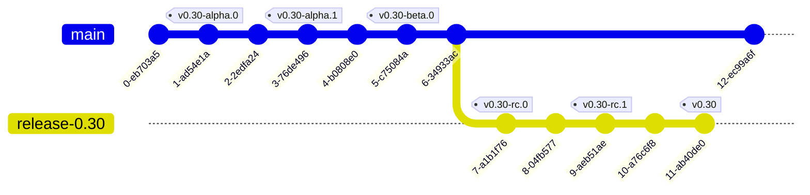

> **Note**
> The procedure for cutting a release is automated and can be found [here](release-procedure.md).

# Overview
- [Versioning](#versioning): KubeVirt uses [semantic versioning](http://semver.org)
- [Content](#content): Primary artifact is the source tree in form of signed git tag. Binary artifacts are built for convenience by automation
- [Platform Support](#platform-support): Every KubeVirt release is targeted towards the most recent and validated against Kubernetes releases in the support period
- [Schedule](#schedule): Time based releases aligned to Kubernetes
- [Lifecycle](#release-lifecycle): stabilization and release are followed by a maintenance phase, bound to the maintenance phase of the corresponding Kubernetes release

# Content

The primary artifact of a release is the source tree itself. The trust on the
tree is established by using a signed git tag.

For convenience a number of binary artifacts can be provided alongside a
release, those are:

- Container images (currently docker images), tagged and pushed to a registry
- Client side binaries (i.e. _virtctl_), published on the release page

These artifacts are provided in their respective channels and their natural way
of distribution.

# Platform Support

Every KubeVirt release is

 i. targeted towards and life-time coupled with the most recent Kubernetes release
ii. throughout it's life-time the release is validated against the Kubernetes release
    in the [support period](https://kubernetes.io/releases/patch-releases/#support-period)
    at the time of GA of the KubeVirt release

For example:
* KubeVirt v1.0 is targeted towards Kubernetes v1.27.
* KubeVirt v1.0 will be supported until Kubernetes v1.27 runs out of support.
* KubeVirt v1.0 will be validated against all Kubernetes versions being in
  the support period at the time of the v1.0 GA

Leading to:
* At v1.27 GA: v1.0 with v1.27, v1.26, v1.25
* At v1.28 GA: v1.0 with v1.27, v1.26
* At v1.29 GA: v1.0 with v1.27
* At v1.30 GA: v1.0 EOL as v1.27 slipped out of the support period.

This is reflected in three areas:

1. _CI_ - A precondition of a release is the presence of CI lanes for the targeted Kubernetes release
2. _Schedule_ - A KubeVirt release will be trailing it's corresponding Kubernetes release. It is trailing it, in order to perform the stabilization on a released Kubernetes version
3. _Support matrix_ - A KubeVirt release's maintenance phase is tied to the maintenance phase (called _support period_) of a Kubernetes release.

The primary reasons for defining a target Kubernetes release are:

- Understanding the target platform in order to perform proper integration work

The primary reasons for defining compatible Kubernetes releases are:

- CI resources are finite. And people to maintain it as well.
- Limit the maintenance burden
- Setting the right expectations with end-users
- Define when a KubeVirt release is ending its regular support

The Kubernetes release corresponding to a KubeVirt release is defined in the release metadata of a KubeVirt release maintained by [SIG Release](https://github.com/kubevirt/sig-release/).

## Platform Support Skew

Although we target a specific Kubernetes release, we recognize that there are reasons to support more than one Kubernetes version.
While the KubeVirt Community can not provide this support, patches to support other releases will be considered as long as they are provided in a reasonable manner (scope and time wise).

# Schedule

[SIG Release](https://github.com/kubevirt/sig-release/) is keeping track of specific releases.
In this document the generic process around releases is outlined.

## Minor releases

KubeVirt aligns to the [Kubernetes release cycle](https://www.kubernetes.dev/resources/release/).
But because KubeVirt builds upon Kubernetes, it will trail Kubernetes' release schedule by roughly 2 months, in order to have time to consume and stabilize on top of new releases.

Thus new release branches are cut 3 times a year, or about every 15 weeks.

## Alpha, Beta, and Release Candidates constraints

The release schedule is build around a few guiding principles:

- Alpha and Beta tags must be created before branching for a stable release
- Release branch must only be cut after a Kubernetes minor releases
- Release-Candidate (RC) and Release (GA) tags must be created on release branches

## Release schedule schema

This can then be translated into the following KubeVirt release schedule schema:

| Week of the K8s Rel. Cycle | KubeVirt Ms. | Note                             |
|:--------------------------:|--------------|----------------------------------|
|          14 - 8            | Alpha        | KubeVirt alpha.0 on main         |
|          14 - 4            | Beta         | KubeVirt beta.0 on main          |
|          14 - 4            |              | Start the KubeVirt CI provider   |
|            14              |              | Kubernetes release               |
|          14 + 4            |              | CI lanes for provider are voting |
|          14 + 8            | EF           | KubeVirt stable branch is cut    |
|          14 + 9            | RC           | KubeVirt rc.0 on release branch  |
|          14 + 10           | RC           | KubeVirt rc.1 on release branch  |
|          14 + 11           | GA           | KubeVirt GA                      |

**EF** Enhancement Freeze, **RC** Release Candidate, **GA** General Availability
 

# Versioning

KubeVirt is using [sematic versioning](https://www.semver.org).
Versions are declared with git tags.

## Tag naming convention

Milestone and Release tags adhere to [semantic versioning conventions](http://semver.org).

Let's look at a few examples surrounding the release `v0.30`.

> **Note**
> Alpha and Beta tags are create on the `main` branch.

Alpha, and Beta tag examples:

    v0.30.0-alpha.0
    v0.30.0-alpha.1
    v0.30.0-beta.0
    v0.30.0-beta.1

> **Note**
> RC and GA tags are create on the stable branch of a release.

Release-Candidate tag examples:

    v0.30.0-rc.0
    v0.30.0-rc.1

GA Release tag example:

    v0.30.0

## Stable branch naming convention

For example, the initial release candidate for branch `release-0.30` is called
`v0.30.1-rc.0`

The determined version is then prefixed with a `v` (mostly for consistency,
because we started this way) and used as the tag name (`$TAG` below).

Branches are created for every minor release and take the form of

    release-<major>.<minor>

For example, the release branch for a v0.30.0 release will be

    release-0.30

Putting all of the above together will lead to the following graph:

# Release Lifecycle

Today a KubeVirt release consists of two phases:

1. _Stabilization phase_ - The timeframe from the stable branch cut all the way towards - and ending with - a new KubeVirt release
2. _Maintenance phase_ - The timeframe starts with a new KubeVirt release and ends with the release's [End-Of-Life](#end-of-life-eol)

## Stabilization phase

The stabilization phase of a release begins with the stable branch creation.
The stabilization of a release takes place on the stable branch of the release.

### Bug fixes

Once the branch is created, only backports will be allowed into the stable branch, following KubeVirt's [backport policy](release-branch-backporting.md).

### Blockers

If blockers are detected, then they first have to be fixed, and then a new release candidate is generated and will be promoted after giving the impacted parties enough time to validate the blocker is addressed.

The procedure for handling blockers is described in [release-procedure.md](release-procedure.md).

### Release readiness

The following pre-conditions need to be met before any release tags are created (RC, GA).

#### CI Provider

A pre-condition for the GA of a KubeVirt release is the presence of a KubeVirt CI provider for the corresponding Kubernetes release.
Around the beta release of the corresponding Kubernetes release, the KubeVirt team will start to work on a KubeVirt CI provider.
The assumption is, that the KubeVirt CI provider will be available by KubeVirt's enhancement freeze.

The introduction of a new provider has the following phases:
1. Provider is created
2. Provider is published
3. Provider lands in kubevirt/kubevirt
4. Periodic and presubmit lanes get introduced for the sigs `compute`, `network`, `storage` and `operator`, where
   1. while the periodics deliver a signal for how KubeVirt and the provider are interacting, the presubmits initially are to be triggered manually, so that teams can work on fixing bugs in either the provider or the KubeVirt code
   2. at the point when the periodics look stable enough, the presubmits are turned on to run on every PR
   3. if the signal is looking stable enough, they are made voting (will gate a PR)

### Holidays

Just like in Kubernetes, there will be slowdowns during common holidays which will
cause delays.  So releases that overlap with holidays may be delayed.

### Release procedure

If the release is stable, the release readiness conditions are met, and all holidas are over, then it is finally time to make a release generally available.

The procedure for making a release generally available is described in [release-procedure.md](release-procedure.md).

### Announcement
Every official release must be announced on the `kubevirt-dev` mailinglist
<kubevirt-dev@googlegroups.com> with a body containing the release notes.

You can retrieve the auto generated release notes from the git tag's commit message.

Below is an example of getting the release notes for `v0.31.0-rc.0`

    $ git show v0.31.0-rc.0

## Maintenance phase

The maintenance phase of a KubeVirt release is tied to the [support period](https://kubernetes.io/releases/patch-releases/#support-period) of the corresponding Kubernetes release.

### Bug fixes

During the maintenance phase contributors can backport fixes to a stable branch accoiring to the KubeVirt [backport policy](release-branch-backporting.md).

### Patch releases

During the maintenance phase, KubeVirt will provide patch releases on an irregular basis. 

### End-Of-Life (EOL)

A KubeVirt release will reach its end of life (EOL) once the Kubernetes support period ends.

The EOL of a KubeVirt release is currently not enforced. Fixes can be backported as long as maintainers are willing to approve them.
