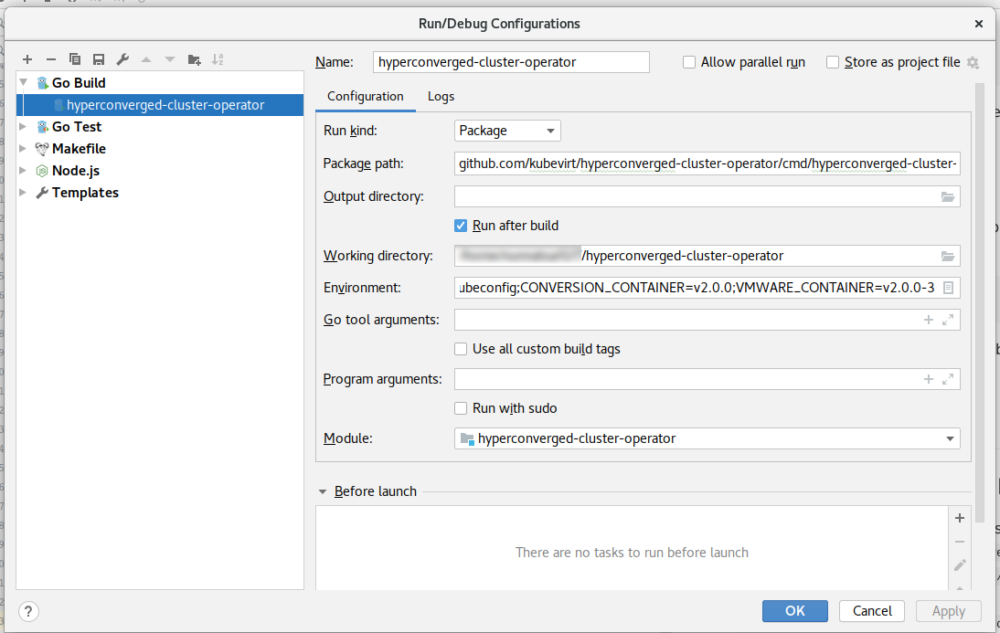
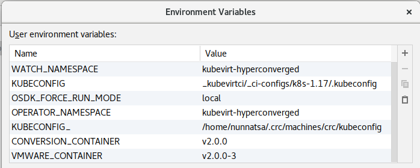
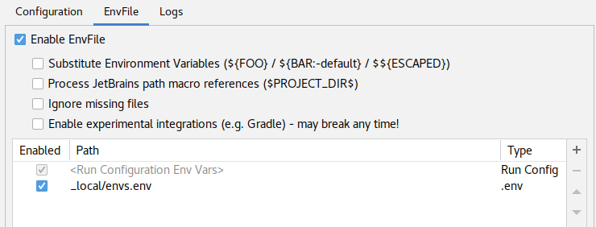
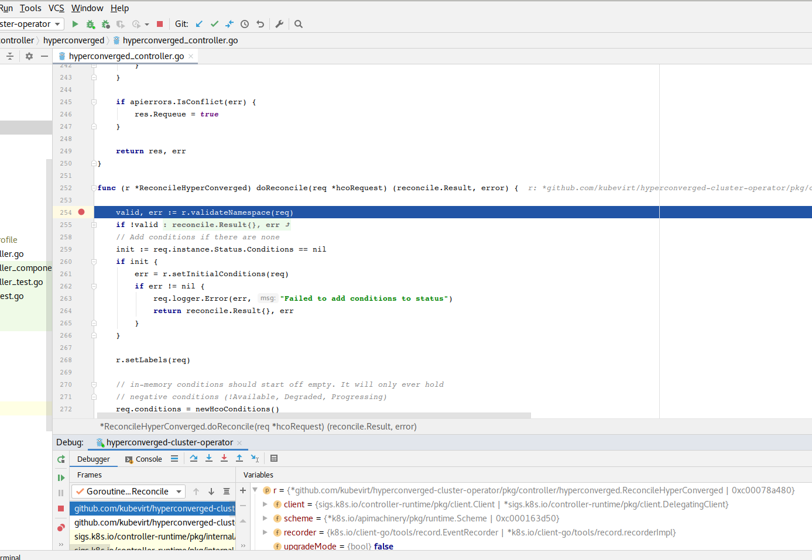
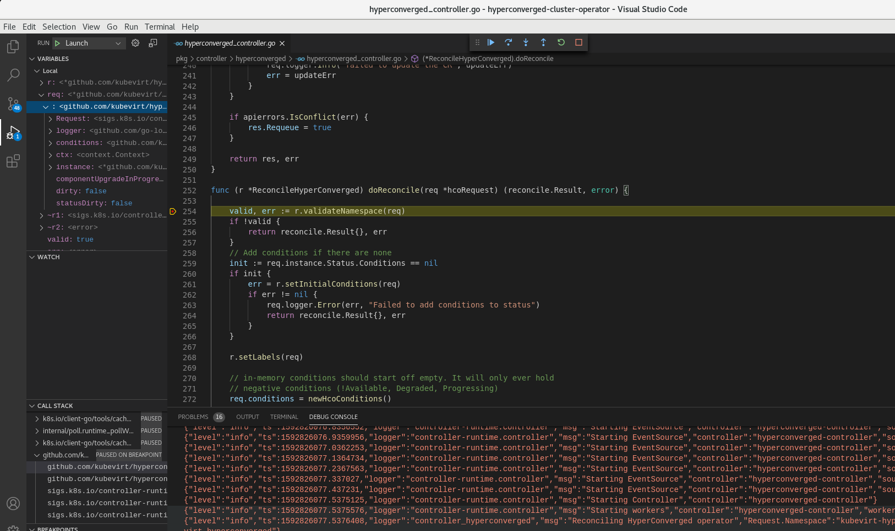

# Run HCO Locally From an IDE

***NOTE***: metrics is not supported when running locally.

## Pre-Requirements

### Kubernetes
The local HCO is going to run from an IDE, but it should communicate with a running kubernetes cluster.

In order to run, you'll need a running kubernetes, and the right configuration. Set the `KUBECONFIG` environment variable 
to the running kubernetes configurations.

Running HCO locally tested with
* [minikube](https://kubernetes.io/docs/setup/learning-environment/minikube/)
* [Code-Ready Container (CRC)](https://github.com/code-ready/crc)
* kubevirtci - for example:
  ```shell script
  $ export KUBEVIRT_PROVIDER=k8s-1.17
  $ make cluster-up
  ```
  Then, the `KUBECONFIG` environment variable should be set to `_kubevirtci/_ci-configs/k8s-1.17/.kubeconfig`.


### Local Deployments
It is required to deploy some CRDs and deployments before running the HCO itself, by running:
```shell script
$ make local
```

This will set all the CRDs and run all the KubeVirt operators except for the HCO itself, as it's going to be run from the IDE.

In addition, the `make local` also creates a file, with the required environment variables. By default, the script will 
create a semicolon separated list environment variables. The default file is `_local/envs.txt`. It is also possible to 
generate an env file instead by setting `FORMAT` to `env`:
```shell script
$ FORMAT=env make local
``` 

This will generate the `local/envs.env` file instead of `_local/envs.txt`.

`make local` command respects these variables as well: `DEBUG_WEBHOOK` and `DEBUG_WEBHOOK`. If you want to run only webhook locally, you can use this command
```shell script
$ FORMAT=env DEBUG_WEBHOOK=true DEBUG_OPERATOR=false make local
```

## Running HCO from an IDE

### Running From goland (or Intellij with golang plugin)

Add new "Go Build" run configuration.

* Set the `Run kind` to `package`.
* Set `Package path` to `github.com/kubevirt/hyperconverged-cluster-operator/cmd/hyperconverged-cluster-operator`.
* Make sure the working directory is the project's root directory.
* Set the environment variables:

`make local` creates the `_local/envs.txt` file that includes all the required environment variables in GoLand/Intellij
format. Copy  the content of this file to the `Environment` field. The minimum requirement environment variables are:
  * `WATCH_NAMESPACE=kubevirt-hyperconverged`
  * `KUBECONFIG=_kubevirtci/_ci-configs/k8s-1.17/.kubeconfig` (example)
  * `OSDK_FORCE_RUN_MODE=local`
  * `OPERATOR_NAMESPACE=kubevirt-hyperconverged`
  * `CONVERSION_CONTAINER=v2.0.0` (example)
  * `VMWARE_CONTAINER=v2.0.0-4` (example)

**Tip**: Instead of setting the environment variables as text, install the [EnvFile](https://plugins.jetbrains.com/plugin/7861-envfile) 
plugin, then run `FORMAT=env make local` to generate the `_local.envs.env` file. Then change the run configurations to 
use this new env file.



Now it is possible to run or debug as any golang software.



### Running from microsoft VS Code
Use the following `launch.json` file for configurations:
```json5
{
    "version": "0.2.0",
    "configurations": [
        {
            "name": "Launch",
            "type": "go",
            "request": "launch",
            "mode": "auto",
            "program": "${workspaceFolder}/cmd/hyperconverged-cluster-operator/main.go",
            "cwd": "${workspaceFolder}",
            "env": {
                "WATCH_NAMESPACE": "kubevirt-hyperconverged", 
                "KUBECONFIG": "_kubevirtci/_ci-configs/k8s-1.17/.kubeconfig",
                "OSDK_FORCE_RUN_MODE": "local",
                "OPERATOR_NAMESPACE":"kubevirt-hyperconverged",
                "CONVERSION_CONTAINER": "v2.0.0",
                "VMWARE_CONTAINER": "v2.0.0-4"
            },
            "args": []
        }
    ]
}
```
Take the actual environment variables from the `_local/envs.txt` file.

**Note**: `KUBECONFIG`, `CONVERSION_CONTAINER` and `VMWARE_CONTAINER` above are examples. Set the values that match your
environment.

Now it is possible to run HCO from VS Code.




## Opening a tunnel for webhook

  To be able to receive requests from k8s cluster to your local process, you have to open a tunnel between your local environment and the cluster.

  `Telepresence` is an open source tool that lets you run a single service locally, while connecting that service to a remote Kubernetes cluster. For more information, see https://www.telepresence.io/discussion/overview

  Install telepresence by following the doc here https://www.telepresence.io/reference/install

  Before running webhook, *in another terminal*, create a telepresence deployment into the cluster by running
  ```shell script
  telepresence -n kubevirt-hyperconverged --new-deployment  hyperconverged-cluster-webhook-service  --expose 4343
  ```
  
  If you receive `AlreadyExists` error from telepresence because of earlier run, delete the leftovers with the commands below.
  ```shell script
  kubectl -n kubevirt-hyperconverged delete pod hyperconverged-cluster-webhook-service --ignore-not-found
  kubectl -n kubevirt-hyperconverged delete service hyperconverged-cluster-webhook-service --ignore-not-found
  ```

  Then run the `/cmd/hyperconverged-cluster-webhook/main.go` as you run the operator explained above.

## Creating HyperConverged CR

After preparing your environment, you can create the HyperConverged CR with the command below.

```shell script
kubectl -n kubevirt-hyperconverged create -f deploy/hco.cr.yaml
```