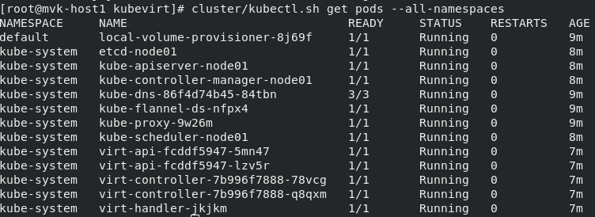
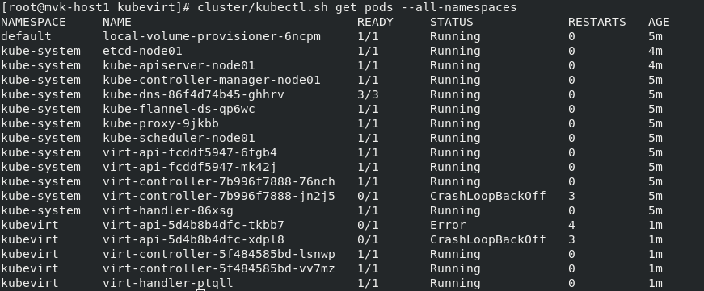
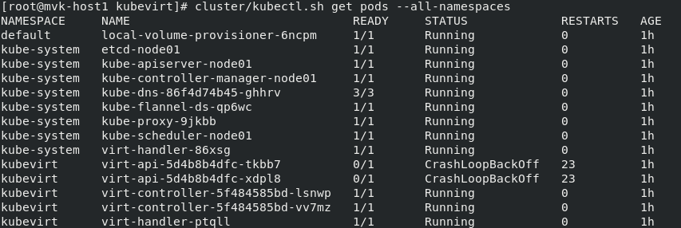
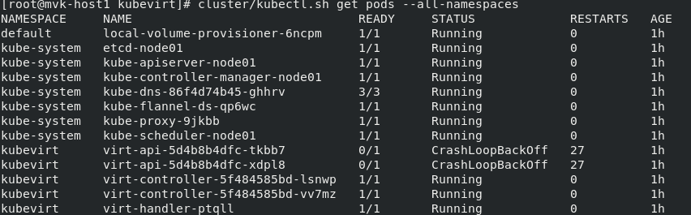
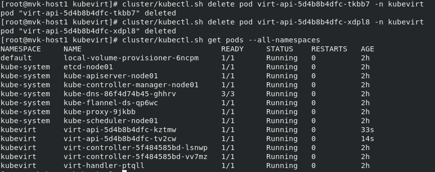

# Upgrading KubeVirt

This document outlines the step by step process of upgrading kubevirt
from the perspective of the kubevirt-operator.  These steps can also
be done by hand.

**Minor Upgrade** - upgrade from 1.0 to 1.1

**Major Upgrade** - Upgrade from 1.0 to 2.0

## Minor Upgrade -
### From v0.11.0 to v0.12.0

*This was tested using kubevirt development environment

#### Pods status at the beginning of the process:

#### Start the upgrade to v0.12.0

1. Create kubevirt namespace:

    `# cluster/kubectl.sh create namespace kubevirt`

    v0.12.0 introduced a new namespace called ‘kubevirt’ so before we apply the new configuration we will have to create it.
    *This step is specific for the upgrade between v0.11 and v0.12 .*

2. Apply new manifests

    `# cluster/kubectl.sh apply -f ~/kubevirt-12.yaml`

    __Pods status:__
    

    We can see virt-api,virt-controller and virt-handler were created in the ‘kubevirt’ namespace while these the old configuration in kube-system namespace still exist. Thus, they need to be deleted.

    __Errors we get from each component:__
    1. Virt-api on kubevirt namespace (both have same errors)

        `# cluster/kubectl.sh logs -f virt-api-5d4b8b4dfc-xdpl8 -n kubevirt`

        __output__ : _panic: apiservice [v1alpha2.subresources.kubevirt.io] is already registered in a different namespace. Existing apiservice
        registration must be deleted before virt-api can proceed._

    2. (old) Virt-controller on kube-system namespace

        `# cluster/kubectl.sh logs -f virt-controller-7b996f7888-jn2j5 -n kube-system`

        __output__ : _panic: configmaps "kubevirt-config" is forbidden: User "system:serviceaccount:kube-system:kubevirt-controller" cannot get configmaps in the namespace "kube-system"_


3. Delete deployments: virt-api, virt-controller

    `# cluster/kubectl.sh delete deployment virt-api -n kube-system`

    `# cluster/kubectl.sh delete deployment virt-controller -n kube-system`

    __Pods status:__
    

    __Error from Virt-api on kubevirt namespace (both have same errors)__

    `# cluster/kubectl.sh logs -f virt-api-5d4b8b4dfc-xdpl8 -n kubevirt`

    __output__ : _panic: apiservice [v1alpha2.subresources.kubevirt.io] is already registered in a different namespace. Existing apiservice registration must be deleted before virt-api can proceed._

4. Delete daemonset : virt-handler

    `# cluster/kubectl.sh delete daemonset virt-handler -n kube-system`

5. Delete service : virt-api

    `# cluster/kubectl.sh delete service virt-api -n kube-system`

6. Delete apiservice :  v1alpha2.subresources.kubevirt.io

    `# cluster/kubectl.sh delete apiservice v1alpha2.subresources.kubevirt.io`

    __Pods status:__
    

    __Error from Virt-api on kubevirt namespace (both have same errors)__

    `# cluster/kubectl.sh logs -f virt-api-5d4b8b4dfc-xdpl8 -n kubevirt`

    __output__ : _panic: ValidatingAdmissionWebhook [virt-api-validator] is already registered using services endpoints in a different namespace. Existing webhook registration must be deleted before virt-api can proceed._

7. Delete webhook 1 : virt-api-validator

    `# cluster/kubectl.sh delete validatingwebhookconfiguration virt-api-validator -n kube-system`

8. Delete webhook 2 : virt-api-mutator

    `# cluster/kubectl.sh delete mutatingwebhookconfiguration virt-api-mutator -n kube-system`

    After deleting the two webhooks, virt-api still prints the error of existing webhooks registration.
    Thus, we delete the virt-api pods on kubevirt namespace, so they could be re-created and register to the new webhooks.

9. Create the virt-api pods again on kubevirt cluster

    `# cluster/kubectl.sh delete <virt-api-pod1> -n kubevirt`

    `# cluster/kubectl.sh delete <virt-api-pod2> -n kubevirt`

    __Pods status:__
    

    __DONE__

## Major Upgrade - (Plan)

*When the kubevirt-operator sees the Virt CR change from version 1.1 to 2.0 it will...*
 - Rollout kubevirt-2.0 virt-handler daemonsets
 - Test virt-handler functionality with kubevirt-2.0 data
 - Scale down virt-controllers pods
 - Scale down virt-api pods
 - Register kubevirt-2.0 CRD webhooks
 - Update to kubevirt-2.0 CRDs
 - Rollout kubevirt-2.0 virt-controllers
 - Test virt-controller functionality with kubevirt-2.0 data
 - Rollout kubevirt-2.0 virt-api
 - Test virt-api functionality with kubevirt-2.0 data

### Virt-launcher Upgrade
Upgrading virt-launcher will require the VM to be shutdown and rescheduled. In
order to mitigate vm interuptions, virt-launcher will be forwards compatible
with:
(release x.y)
 - all minor kubevirt versions (>= y)
 - one major version (x + 1)

Once migrations are production-ready, additional compatibility restrictions may
be introduced.
