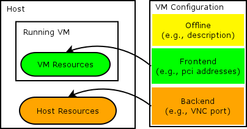

Virtual Machine Configuration
=============================

The configuration of virtual machines is one of the core tasks to accomplish
with kubevirt. At the public kubernetes API layer, this will involve the user
creating manifests that follow the published schema for one or more third party
resource types. Internally, kubevirt will be using libvirt for managing QEMU,
so there is a need to convert between the public resource descriptions and the
libvirt XML document formats.

This document will only consider the configuration associated with a specific
instance  of a virtual machine. It will ignore the topic of 'templating' by
which a higher level generalised config can be used as a cookie cutter for
creating many guests.


Frontend / backend split
------------------------

The libvirt domain XML schema defines configuration for two related, but
separate concepts. The frontend configuration elements describe the hardware to
expose for the virtual machine. This covers aspects like peripheral device
models, PCI addresses, RAM/CPU setup, BIOS metadata and more.  The backend
configuration elements describe how the frontends are integrated with the host
operating system services. This covers aspects like which file path is used for
the virtual disk storage, which network interface is connected to the virtual
interface, and performance tuning metrics such as CPU scheduler policies, disk
and NIC I/O limits, or NUMA placement.

Generally the choice of backend config is independent of the choice of frontend
config. For example, a guest can be given multiple virtual NUMA nodes, even if
the host only has a single physical NUMA node. Some combinations may result in
sub-optimal performance, but the choice is typically left to the administrator
or management apps. In certain places, however, there are strict relationships.
For example, the vhostuser network backend in QEMU requires uses of a
virtio-net frontend device.

The frontend configuration is what is seen by the guest, and for some guests it
is important that this does not change after initial provisioning. For example,
if the PCI topology changes, Windows may no longer be able to determine which
disks to use, or it may require license key reactivation. Changing the backend
configuration is totally transparent to the guest (aside from performance
differences inherent in different backend choices).




Portability issues
------------------

The backend configuration information in the libvirt XML schema for configuring
a virtual machine is a representation that is focused on deployment on a
specific host. It is explicitly not a format that is guaranteed portable across
all hosts in a clusters.

Similarly, the frontend configuration information is focused on deployment of
a specific guest instance. It is not a format that can be directly used as a
template for creating many guests, without making certain changes, such as MAC
addresses in NICs, BIOS UUIDs, disk serial numbers and so on.

If a guest is deployed on a particular host, and then needs moving to a
different host, there is a non-negligible chance that changes will be required
in backend config of the XML configuration. For example, the ports currently
used for VNC may not be available on the new host, or the storage devices that
need to be used may require a different /dev/sdNN device path.

There are ways to minimise these differences, to increase portability between
hosts. For example, instead of hardcoding a VNC port, allow libvirt to perform
automatic allocation, or instead of using an unstable /dev/sdNN path, Linux
provides /dev/disk/by-path/XXX symlinks which might be stable across hosts.


Security issues
---------------

There are many security features in libvirt, however, they are primarily focused
around protection from malicious or misbehaving guests. For example, sVirt will
stop guests attacking each other, or the host. NWFilter will stop guests doing
IP/MAC/ARP spoofing on the network.

There is a fine grained access control mechanism for the host facing management
API, however, the checks are performed against the (subject, object, action)
tuple. So while you can block a user or application from being able to invoke
the 'virDomainDefineXML' action, if you allow this API, you cannot then control
what information is passed in its parameters. For example, when configuring
disks in the domain XML, arbitrary host paths can be specified as the backing
storage for the virtual disk. Libvirt will happily let /etc/passwd be specified
as the disk backing store. When libvirt starts the QEMU instance, it will then
tell sVirt to grant access to the /etc/passwd file.

IOW, any application which can invoke the virDomainDefineXML method on the
libvirtd daemon has a privilege level which is equivalent to that of libvirtd
itself, which is root. Thus applications calling virDomainDefineXML (and many
other APIs) which accept configuration input from untrusted users, to feed into
an XML document, must be very careful in their data handling.


Config states
-------------

Naively one might expect a virtual machine to have a single document describing
its configuration. In practice, this is unreasonably restrictive.

The configuration provided by a tenant or management application will typically
not express every single frontend or backend setting. When the XML document is
provided to libvirt, it will fill in any important missing pieces of information
in an attempt to fully represent the virtual hardware configuration and backend
integration. For example, if the tenant did not supply PCI addresses, libvirt
will assign them prior to starting QEMU. Even when libvirt fills in missing
data this is only ever libvirt's best attempt at a complete virtual hardware
configuration. For example, for ISA serial ports, libvirt does not record the
hardware I/O port associated with the serial port, since that is not currently
a configurable option & thus can be assumed stable without being explicitly
represented. A future libvirt or QEMU, may allow I/O port configuration, and
thus when upgrading to newer libvirt, the XML document previously considered
to be complete may have yet more defaults filled in.

Applications that wish to be able to start the guest multiple times, while
guaranteeing a stable hardware ABI, need to capture the augmented configuration
and use it on subsequent boot attempts. Depending on which libvirt APIs are
used, the augmented configuration can be obtained without starting the guest,
or at the same time as starting a guest.

When a guest is started, some aspects of backend configuration may be
dynamically filled in. For example, an automatically chosen VNC port will be
reported in the XML document. This is information that an application will
require for interaction with the guest for as long as it is running, but once
shutoff the information can be discarded.

Running guests can have a variety of configuration changes made to them, in
particular, hotplugging & unplugging of virtual devices such as disks, NICs,
etc. These operations are not all guaranteed to be synchronous, nor are they
even guaranteed to complete at all. For example, unplugging a PCI device
requires co-operation from the guest OS. A guest that is still running the
BIOS, or early boot up, may never honour the unplug request. Malicious or buggy
guests can ignore a request forever too, or take an unexpectedly long time to
complete it.  There is thus a distinction between the configuration that a
running guests currently has, vs what it is desired to have, which is only
resolved when the unplug operation completes.

If disks and memory snapshots are taken of a guest, it is necessary to record
the configuration associated with the guest at that time. When the snapshot is
later activated, the guest must be set to use this original configuration,
which may have different frontend device hardware from the current state. If
the devices have changed since the snapshot was taken, the management
application may not be able to honour the original virtual hardware
configuration if the tenant user no longer has permission to connect the
original devices to suitable backend services on the host. For example, if a
NIC was unplugged since the snapshot was taken, even if the snapshot
configuration has kept track of the existence of this NIC, the tenant may not
be permitted to plug it into any host network. A snapshot can be taken
regardless of whether a guest is running or inactive. The latter case, the
snapshot would only cover disks, while in the format case, the snapshot would
cover disks, and optionally memory too.

Bearing all this in mind there can be multiple configurations associated with
a single instance of a virtual machine.

 1. Initial minimal tenant provided configuration
 2. Expanded configuration for inactive VM
 3. Expanded configuration for running VM reflecting desired state
 4. Expanded configuration for running VM reflecting current state
 5. Zero or many snapshots of the config for either inactive or running VM

An application may choose not to track all of these configurations explicitly.
For example, by converting the minimal configuration, to the expanded inactive
configuration, an application is fixing the virtual machine to the best practice
at a given point in time. This is good if a stable hardware ABI is desired,
but is not required. Some applications may instead prefer to always have the
latest best practice applied to a guest each time it boots, and let the guest
adapt to changes dynamically. Similarly an application tracking the inactive
configuration of the guest, has a choice about how to handle updates to reflect
hotplug/unplug operations. An unplug operation could be applied to the inactive
configuration unconditionally, without waiting for completion on the running
VM. This would ensure that the device goes away on the next cold boot, even if
the guest OS ignores the hotunplug.


Additional document formats
---------------------------

The libvirt domain XML format is just one of many XML formats managed via the
libvirt APIs. Many of the additional XML formats are used in conjunction with
the domain XML, when managing individual virtual machines.

The secret APIs in libvirt and their associated secret XML format provide a way
to push security sensitive credentials into libvirt. This covers items such as
network service client login passwords to be used by QEMU, credentials to be
required for network servers run by QEMU (such as SPICE) and disk encryption
keys or passphrases. These are not included in the domain XML document since
these documents are widely shared and logged without concern for security
sensitive data. Thus any part of the domain XML configuration that requires
security sensitive data will instead provide the UUID of a libvirt secret
object. The sensitive data will be provided to the secret object ahead of time
via a dedicated API.

The nwfilter APIs in libvirt and their associated XML format provide a way to
define firewall rules to filter traffic that flows over guest virtual network
interfaces. These can be used for a wide variety of tasks, but most common is
their use to prevent IP, MAC and ARP spoofing attacks where one guest tries to
impersonate another guest to captures its traffic or inflict a denial of
service.

The node device APIs in libvirt and their associated XML format provide a way
to dynamically create new host devices for use by virtual machines. For example
they allow to create virtual GPU devices, or NPIV virtual SCSI host adapters
which can then be assigned to the guest.


Design implications
-------------------

The key take away from the analysis above is that kubevirt needs to maintain a
strict separation between the libvirt XML document format, and the format used
in the public APIs. The tenant users who are specifying the virtual machine
configuration cannot be permitted to have direct control over most aspects of
backend configuration. This is because they are both untrusted users, and do not
have knowledge about the compute hosts which is required in order to make the
correct choices.

The public k8s virtual machine configuration must allow users to fully specify
the frontend virtual hardware, in order to enable a stable ABI to be attained.

For the backend configuration, some parts can be automatically determined by
kubevirt without requiring any user specification. For example, there is no need
for the user to specify what VNC/SPICE port to use, or where to find the UEFI
BIOS files. It is sufficient to know that VNC or UEFI must be enabled. Other
areas of backend configuration will require the user to specify resources in an
abstracted manner. For example, instead of providing a file path for a disk,
the tenant would provide the name of a PersistentVolumeClaim resource, or
alternative k8s API resource. Further areas of backend configuration will
require users to specify desired goals, which kubevirt then translates into
specific configuration information. For example, the tenant may request
exclusive use of CPUs, and kubevirt has to decide which host CPUs to bind
virtual CPUs to, potentially impacting NUMA node placement of the guest as a
result.

Given a k8s API resource describing the virtual machine, it will be possible to
generate a libvirt domain XML document from scratch. The particular API usage
scenario, however, may affect what information is provided in the domain XML.
The domain XML generated at the time a guest is started, will be the most fully
specified XML in terms of both frontend and backend configuration. If domain XML
is generated in isolation, however, while the frontend can be fully specified,
the backend configuration may remain partially specified. For example, it would
be possible to expand a PVC to a backend disk config, but without knowledge of
a specific host to run the guest, the domain XML cannot contain information
about CPU pinning.

Going in the reverse direction is more difficult in general. The conversion
from the high level k8s resource to the domain XML format is a lossy process.
So given a domain XML document in isolation, it is not possible to generate a
full k8s resource description of the virtual machine. At most it can contain
frontend information. Translating the backend information in the domain XML, to
the backend information required in the k8s resource is impractical or
impossible in many cases. For example, there's no practical way to determine
that a disk path on a particular host corresponds to a specific PVC. There is
none the less a need for a conversion from domain XML to the k8s resource, in
order to preserve the virtual hardware information for subsequent boots. Rather
than trying to perform this conversion in isolation, however, it is more
practical to take an initial k8s resource configuration (which contains all the
high level backend information) and then augment the frontend configuration
data with any missing pieces.

A further complication is that a single k8s API resource, may end up triggering
the generation of multiple libvirt XML documents, the domain XML and associated
documents for secrets, network filters and node devices. So there is not a strict
1-1 mapping between the k8s API resource representation and the libvirt low
level representation.

Mapping rules for mapping libvirt XML to the KubeVirt API
---------------------------------------------------------

In order to support libvirt features, we tend to expose the libvirt API as much
as possible in a 1:1 fashion. However, there are some differences which need to
be taken into account:

 1. Our API is json/yaml and not xml.
 2. Host specifics are not exposed on the API.
 3. We want to make use of the golang xml/yaml/json mappers as much as possible.
 4. Ordering of devices can be important (e.g. for pci address assignment).
 5. KubeVirt also delivers specialized device types (mostly for network and
    storage), which need to be fit into the existing structure.

**Note**: Point **4** is still under debate.

## General mapping rules

### All devices need to live directly under *devices*

In order to allow arbitrary ordering of devices, they all need directly live
under `devices`.

This is OK:

```yaml
devices:
  lun:
    my: data
  video:
    qxl:
      my: data
  lun:
    my: data1
  video:
    qxl:
      my: data1
```

This is **not** OK:

```yaml
devices:
  disks:
    lun:
      my: data
    lun:
      my: data1
  videos:
    qxl:
      my: data
    qxl:
      my: data1
```

### Add clear extension points where KubeVirt provides specializations

Disks and network interfaces are good examples where KubeVirt provides
specializations. See the mapping decisions for them below to get an impression
on how clear extension points can be added. In general allowing to choose
between different optional source or target structs is the preferred mechanism,
to cleanly separate between KubeVirt extensions and libvirt source or target
types.

For device types where no KubeVirt specific extensions are expected, creating
sub-structs is not required. Even differentiating based on `type` fields is OK
there. Examples are `smartcard`, `input` and `controller`.

### Use optional structs to represent different sources or targets

By having an inlined wrapper-struct, containing optional structs corresponding
to different types, we get a reasonable usable API and can maintain explicit
mapping withing the code.

Given a `Disk` which can have different `DiskSource`s

```golang
type Disk struct {
    Name string `json:"name"`
    DiskSource `json:"diskSource,inline"`
}

type DiskSource struct {
   ISCSI *ISCSIDiskSource `json"iscsi,omitempty"`
   NoCloud *NoCloudDiskSource `json"noCloud,omitempty"`
}
```

it will map to

```yaml
disk:
  name: mydisk
  diskSource:
    iscsi:
      blub: bla
disk:
  name: mydisk
  diskSource:
    noCloud:
      blub: bla
```

## Mapping decisions for specific device types

### Disks

`disk`, `lun`, `floppy` and `cdrom` are top level entries in the `devices`
array. Based on them, the `*.target` section can therefore be specialized based
on the top level struct. Further, the `*.source` section can be specialized and
can contain structs for traditional sources like `iscsi` or KubeVirt specific
structs like `noCloud`:

```yaml
devices:
- disk:
    target:
      readOnly: true
    source:
      noCloud:
        secretRef:
          name: mysecret
- cdrom:
    target:
      readOnly: true
      tray: "open"
    source:
      image:
        name:"mydisk:latest"
- floppy:
    target:
      readOnly: true
      tray: "open"
    source:
      image:
        name:"mydisk:latest"
- lun:
    target:
      readOnly: false
    source:
      iscsi:
        targetPortal: 10.0.2.15:3260
        portals: ['10.0.2.16:3260', '10.0.2.17:3260']
        iqn: iqn.2001-04.com.example:storage.kube.sys1.xyz
        lun: 0
```

### Network

Every network interface is wrapped into a `interface` struct. The `model`
attribute and all other guest specific attributes are part of this `interface`
struct. A wrapping `interface.source` struct can contain different source
structs. They can be traditional interface sources like `bridge`, `direct` or
`hostedev`, or KubeVirt specializations like `hostNetwork` or `podNetwork`:

```yaml
devices:
  interface:
    source:
      bridge:
        dev: mybridge
    model: virtio
  interface:
    source:
      podNetwork: {}
    model: virtio
```

### Video

Mapping of the three important video devices `qxl`, `vga` and `virtio` is
planned at the moment. They are wrapped by a `video` struct:

```yaml
devices:
  video:
    qxl:
      blub: bla
  video:
    vga:
      blub: bla
  video:
    virtio:
      blub: bla
```

### Spice and VNC

Spice and VNC need specific devices on the VirtualMachine, but are not devices
themselves. They tell libvirt/qemu to start servers to allow attaching to the
VirtualMachine, but have no influence on the VirtualMachine itself. Therefore
they are moved out of the devices section:

```yaml
spec:
  spice:
    blub: ba
  vnc:
    blub: ba
  devices:
    video:
      qxl:
        blub: bla
```

They will contain almost no fields, since it is expected that the KubeVirt
infrastructure will handle almost all connection aspects.

### Controller

Controller setup is complex and since it does not seem very likely that
KubeVirt will ever have to provide specializations in that area. Therefore
working with a generic blob-like struct should be sufficient:

```yaml
devices:
- controller:
    type: ide
    blub: bla
- controller:
    type: sata
    blub: bla
```
