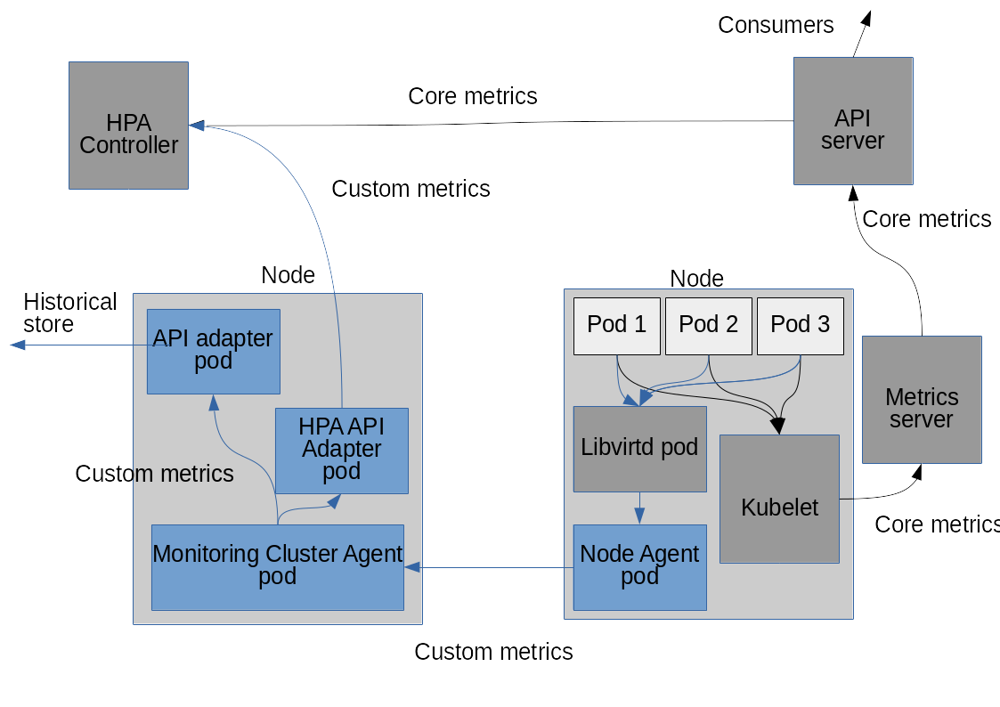

# Overview
VM expose a different, and partially overlapping, set of metrics with
respect to containers. This document explain the differences and how
those metrics are made available to the cluster, to be consumed using
the standard Kubernetes facilities.

## libvirt metrics
[libvirt](https://libvirt.org/) is the virtualization framework that
KubeVirt uses; in order to describe the VM metrics in KubeVirt, the
first step is to inspect what libvirt provides, and how it collect the
data.

In a nutshell, libvirt uses both the QEMU configuration and the standard
facilites of the linux kernel to do the resource limitation and
accounting. As prime example, libvirt uses cgroups, to do resource
accounting for memory, cpu usage, I/O. Thus, we can consider this subset
of metrics to fully overlap with what monitoring system (e.g.
[cAdvisor](https://github.com/google/cadvisor)) already provides.
Let's call this set `system metrics`.

Libvirt exposes a set of hypervisor and operation-specific metrics.
Examples are the migration statistics. Those metrics are usually
available only while the operation is in progress, or shortly after.
Let's call this set `hypervisor metrics`

Lastly, VMs often run a Guest Agent, a deamon which periodically
collects and reports back to the hypervisor another set of metrics.
Let's call this set `guest metrics`

The last two sets have no counterpart in the containers ecosystem, but
are meaningful for VM management. The following table provides a
breakdown of the major VM metrics.

| Metric                             | Group         | Ephemeral | Provided by |
| ---------------------------------- |:-------------:|:---------:|:-----------:|
| CPU time total                     | system        | -         | -           |
| CPU time user                      | system        | -         | -           |
| CPU time system                    | system        | -         | -           |
| nic #x RX/TX bytes                 | system        | -         | -           |
| nic #x RX/TX packets               | system        | -         | -           |
| nic #x RX/TX errors                | system        | -         | -           |
| nic #x RX/TX dropped packets       | system        | -         | -           |
| block device #x R/W operations     | system        | -         | -           |
| block device #x R/W bytes          | system        | -         | -           |
| block device #x R/W total time     | system        | -         | -           |
| block device #x flush operations   | system        | -         | -           |
| block device #x flush total time   | system        | -         | -           |
| block device #x allocation         | system        | -         | -           |
| block device #x capacity           | system        | -         | -           |
| block device #x physical           | system        | -         | -           |
| block device #x threshold          | system        | -         | -           |
| guest state                        | hypervisor    | -         | -           |
| guest state reason                 | hypervisor    | -         | -           |
| memory balloon current             | hypervisor    | -         | -           |
| memory balloon maximum             | hypervisor    | -         | -           |
| virtual CPU count                  | hypervisor    | -         | -           |
| virtual CPU maximum                | hypervisor    | -         | -           |
| virtual CPU #x state               | hypervisor    | -         | -           |
| virtual CPU #x total time          | hypervisor    | -         | -           |
| network interface count            | hypervisor    | -         | -           |
| block device count                 | hypervisor    | -         | -           |
| migration downtime                 | hypervisor    | yes       |             |
| migration elapsed time             | hypervisor    | yes       |             |
| migration total data               | hypervisor    | yes       |             |
| migration processed data           | hypervisor    | yes       |             |
| migration remaining data           | hypervisor    | yes       |             |
| migration total memory             | hypervisor    | yes       |             |
| migration processed memory         | hypervisor    | yes       |             |
| migration remaining memory         | hypervisor    | yes       |             |
| migration memory bps               | hypervisor    | yes       |             |
| migration memory constant [TODO]   | hypervisor    | yes       |             |
| migration memory compression bytes | hypervisor    | yes       |             |
| migration dirty rate               | hypervisor    | yes       |             |
| migration memory iteration         | hypervisor    | yes       |             |
| guest total memory                 | guest agent   | -         |             |
| guest free memory                  | guest agent   | -         |             |
| guest CPU count                    | guest agent   | -         |             |
| guest free disk space              | guest agent   | -         |             |
| guest IP address                   | guest agent   | -         |             |

**NOTE** the list of guest agent provided metrics is partial, because
a lot of different metrics can be collected for the guest. The presented
entries are a subset of what the [QEMU Guest Agent](https://wiki.qemu.org/Features/GuestAgent)
provides, which is used by virtualization managers like
[oVirt](http://www.ovirt.org)

From now on, the overlapping metrics  (aka 'system metrics') will be ignored,
and we will focus on the 'hypervisor' and 'guest agent' metrics.

## collection of VM metrics
A natural fit for the KubeVirt specific metrics is the [custom metrics](
https://github.com/Kubernetes/Kubernetes/blob/release-1.2/docs/proposals/custom-metrics.md).
All the metrics are accessible through the libvirt API.

The collection of the VM metrics will be done by a separate pod, implemented as Kubernetes DaemonSet.
This is because the metrics are available from a centralized source, the libvirt daemon.
To increase resilience, each node should expose all the metrics it knows about, avoiding
a single point of failure per cluster. The resulting architecture is shown in the figure below.

To have the full set the VM metrics, a guest agent like the QEMU Guest Agent should be run
in the virtual machines. This step, albeit recommended, is totally left up to the administrator
of the cluster.

## VM metrics naming rules

In order to minimize the clashes and make the VM metrics name predictable, we adopt the following rules
to set the names:

1. A name should be in the form `{VM name}.{group}.{metric name}`. The dot (`.`) is used as separator.
   the `camelCase` should be used for composite words. Example: `VM0.migration.totalData`

2. Abbreviations should be used only if their meaning is well known and not ambiguous. Examples:

- **BAD**:
  `VM0.migration.bps`
  What `bps` is? Is it Bytes Per Second or Bits per Second? Or something else more specific?
  I need to look it up in the documentation.

3. If not obvious, the metric name should include the unit. Examples:

- **BAD**: `VM0.migration.processedMemory`
  What is it? bytes? KiBs? I need to look it up in the documentation.

- **GOOD**: `VM0.migration.processedMemoryKiB`

4. Keep the common prefixes among related metrics as long as possible. Examples

- **BAD**: `VM0.migration.processedMemory`, `VM0.migration.remainingMemory`

- **GOOD**: `VM0.migration.memoryProcessed`, `VM0.migration.memoryRemaining`

Once name is exported, it is considered part of the API stability and treated accordingly.

TODO: what about name clashes? at least report them? We can do that?

## Consuming the VM metrics

In order to make the task of the consumer easier, the VM metrics provider pod normalizes the
exported dataset in the following manner

- It always export all the metrics it knows about, even if the real data is not yet available.
  Such metrics report the special value [TODO: which one? does this
  concept exist in Kubernetes?] until the real data is available.
  For example, the VM metric `VM.migration.dataTotal` will be always
  reported even before the first migration was attempted, if ever.

- The ephemeral metrics are kept even after libvirt no longer reports them, using the last
  available data (e.g. migration downtime).

However, the VM metrics provider pod will provide no guarantees about
the durability of the data:

- The consumer must take care to any form of persistence it may need.

- The provider provide time series of data without holes in the sequence
  (see normalization notes above).

- The provider will never attempt to recover any past data.

## Implementation notes

To implement the VM metrics collection and reporting, we will initially
adapt the [vAdvisor project](https://github.com/KubeVirt/vAdvisor),
fixing any gaps the project have with the state described above.
vAdvisor is implemented in python. Once vAdvisor is feature-complete, we
will rewrite in golang. This rewrite is motivated by those factors:
- projects in golang have a better integration with the Kubernetes ecosystem
- projects in golang requires a simpler and smaller container image
- we know from experience with [related](http://www.collectd.org)
  [projects](http://www.ovirt.org) that collecting and reporting metrics
  at scale quickly becomes a performance-demanding task, so we need
  to have one efficient service for the task.
