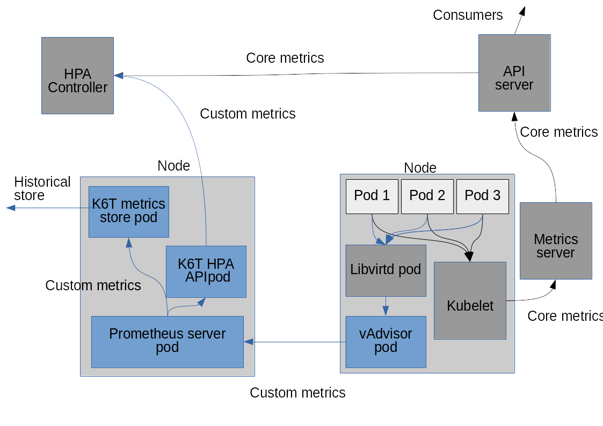

# Overview

This document will cover

- what metrics are relevant for VMs, highlighting overlaps and additions
  with respect to Kubernetes core metrics
- node agent: collection of the VM metrics
- implementation of the monitoring pipeline: extra components besides the node agent

## Libvirt metrics
[libvirt](https://libvirt.org/) is the virtualization framework that
KubeVirt uses. The libvirt control daemon, libvirtd, does its own independent
collection of the VM metrics. 
libvirtd uses both the QEMU configuration and the standard
facilites of the linux kernel to do the resource limitation and
accounting. For example, libvirt uses cgroups, to do resource
accounting for memory, cpu usage, I/O.

Libvirtd provides metrics that roughly overlaps with Kubernetes
[core metrics](https://github.com/kubernetes/community/blob/master/contributors/design-proposals/instrumentation/monitoring_architecture.md)
For the purpose of VM monitoring we may or may not use this subset,
relying on the Kubernetes core metrics.

The other metrics falls nicely in the so-called [monitoring pipeline](
https://github.com/kubernetes/community/blob/master/contributors/design-proposals/instrumentation/monitoring_architecture.md).
For the sake of readability, we can however further partition the
set of metrics as follows.

Libvirt exposes a set of hypervisor and operation-specific metrics.
Examples are the migration statistics. Those metrics are usually
available only while the operation is in progress, or shortly after.
Let's call this set _hypervisor metrics_.

Lastly, VMs often run a Guest Agent, a deamon which periodically
collects and reports back to the hypervisor another set of metrics.
Let's call this set _guest metrics_.

The last two sets have no counterpart in the containers ecosystem, but
are meaningful for VM management. The following table provides a
breakdown of the major VM metrics.

| Metric                             | Group                 | Ephemeral |
| ---------------------------------- |:---------------------:|:---------:|
| CPU time total                     | core                  | -         |
| CPU time user                      | core                  | -         |
| CPU time system                    | core                  | -         |
| nic #x RX/TX bytes                 | core?                 | -         |
| nic #x RX/TX packets               | core?                 | -         |
| nic #x RX/TX errors                | core?                 | -         |
| nic #x RX/TX dropped packets       | core?                 | -         |
| block device #x R/W operations     | core?                 | -         |
| block device #x R/W bytes          | core?                 | -         |
| block device #x R/W total time     | core?                 | -         |
| block device #x flush operations   | core?                 | -         |
| block device #x flush total time   | core?                 | -         |
| block device #x allocation         | core?                 | -         |
| block device #x capacity           | core?                 | -         |
| block device #x physical           | core?                 | -         |
| block device #x threshold          | core?                 | -         |
| guest state                        | monitoring/hypervisor | -         |
| guest state reason                 | monitoring/hypervisor | -         |
| memory balloon current             | monitoring/hypervisor | -         |
| memory balloon maximum             | monitoring/hypervisor | -         |
| virtual CPU count                  | monitoring/hypervisor | -         |
| virtual CPU maximum                | monitoring/hypervisor | -         |
| virtual CPU #x state               | monitoring/hypervisor | -         |
| virtual CPU #x total time          | monitoring/hypervisor | -         |
| network interface count            | monitoring/hypervisor | -         |
| block device count                 | monitoring/hypervisor | -         |
| migration downtime                 | monitoring/hypervisor | yes       |
| migration elapsed time             | monitoring/hypervisor | yes       |
| migration total data               | monitoring/hypervisor | yes       |
| migration processed data           | monitoring/hypervisor | yes       |
| migration remaining data           | monitoring/hypervisor | yes       |
| migration total memory             | monitoring/hypervisor | yes       |
| migration processed memory         | monitoring/hypervisor | yes       |
| migration remaining memory         | monitoring/hypervisor | yes       |
| migration memory bps               | monitoring/hypervisor | yes       |
| migration memory constant [TODO]   | monitoring/hypervisor | yes       |
| migration memory compression bytes | monitoring/hypervisor | yes       |
| migration dirty rate               | monitoring/hypervisor | yes       |
| migration memory iteration         | monitoring/hypervisor | yes       |
| guest total memory                 | monitoring/guest      | -         |
| guest free memory                  | monitoring/guest      | -         |
| guest CPU count                    | monitoring/guest      | -         |
| guest free disk space              | monitoring/guest      | -         |
| guest IP address                   | monitoring/guest      | -         |

**NOTE** the list of guest agent provided metrics is partial, because
a lot of different metrics can be collected for the guest. The presented
entries are a subset of what the [QEMU Guest Agent](https://wiki.qemu.org/Features/GuestAgent)
provides, which is used by virtualization managers like
[oVirt](http://www.ovirt.org)

## KubeVirt monitoring pipeline

Let's review the Kubernetes monitoring pipeline diagram, illustrating both the core
pipeline and the monitor pipeline.

Borrowing the names and the color code of the above diagram, the following diagram
illustrates how the KubeVirt monitoring pipeline will look like

To have the full set the VM metrics, a guest agent like the QEMU Guest Agent should be run
in the virtual machines. This step, albeit recommended, is totally left up to the administrator
of the cluster.

The key components of the monitoring pipeline are:

- The KubeVirt clustr agent: we can use a standard Prometheus server instance
- The KubeVirt monitoring node agent, see below for the details
- The KubeVirt HPA API adapters (HPA and historical storage), see below for details

## KubeVirt node agent: collection of VM metrics

The KubeVirt node agent is in charge to connect to the libvirt pod, fetch the VM metrics
and expose a Prometheus endpoint, to let the KubeVirt cluster agent - a prometheus instance -
collect and aggregate the cluster metrics.

Optionally, the KubeVirt node agent could do some simple data normalizations as follows:

- The KubeVirt node agent will have one option to always export all the metrics it knows about,
  even if the real data is not yet available.
  Such metrics report the special value [TODO: which one? does this
  concept exist in Kubernetes/Prometheus?] until the real data is available.
  For example, the VM metric $VM_migration_data_total will be always
  reported even before the first migration was attempted, if ever.

- The node agent will have one option to keep the last known values of ephemeral metrics
  after libvirt no longer reports them, for example again the $VM_migration_data_total metric
  will be reported even after the migration is completed

The normalization features will be controlled by node agent options (e.g. command line switches).

### Implementation

The requisites of the KubeVirt node agent, besides the obvious need to connect to libvirt and
to expose a prometheus endpoint, are performance and reliability. The collection of metrics
should require the minimal amount of resources, both as runtime and as container image.
We know from the experience that shared storage issues may cause VMs to hang, and libvirt
may in turn hang while collecting metrics from stuck VMs. We want the Node Agent to cope
gracefully with this scenario, and keep reporting the metrics of the live VMs, skipping
the stuck VMs. Reporting of stuck VMs is part of health monitoring, which is out of the
scope of this document.

The options to implement the KubeVirt node agent are:

#### vAdvisor
We can enhance the [vAdvisor project](https://github.com/KubeVirt/vAdvisor) to implement
the missing features described above.

**PROS**
- The project already offers a fair amount of the features we need, it's a great starting point
- Implemented in python, we can optionally reuse code from the oVirt monitoring

**CONS**
- Implemented in python, we know from experience in the oVirt project that python is a poor choice
  scalability-wise. To properly address scale, we will need a rewrite in the future.
- Implemented in python, requires a relatively big container image

#### vAdvisor, reimplemented
We can take vAdvisor as starting point and rewrite it in golang - to better integrate with
the ecosystem right at the start instead of later, and implement the missing features on the
golang codebase.

**PROS**
- No scalability issues
- Better integration with the ecosystem
- Minimal image size

**CONS**
- We will pay the rewrite cost upfront. But if we keep the design basics, we can minimize the effort.
  [Initial experimentations](https://github.com/fromanirh/go-vAdvisor) gave promising results about
  the development speed

#### collectd
The [collectd](http://collectd.org/) project fullfills all the KubeVirt monitoring needs, featuring
a wealth of plugins including a Prometheus endpoint and one libvirt connector.
Collectd is a well established monitoring solution and it is often mentioned in the examples of
the Kubernetes documentation about setting a monitoring pipeline.

**PROS**
- Most of the functionalities ready
- Established, mature solution
- Small image size

**CONS**
- Reporting of ephemeral metrics could need work and acceptance upstream
- Collectd uses a custom way to report metrics that may mismatch with Prometheus
- long release cycle

## KubeVIRT API Adapters: VM metrics naming rules

The task of the KubeVirt HPA API adapter is to expose the metrics collected by the cluster agent
as custom metrics. The main challenge for this component is to provide a stable API and a naming
convention for the VM metrics.

Wherever possible **we should follow the existing naming conventions**. The following guidelines
aims to make the metrics easier to use for the VM case, but are still under discussion.

The additional requirement for VM metrics are
- predictability of the names: names should use a common pattern as much as possible
- avoid or at least minimize the clashes: wherever useful, it it should be possible to
  disaggregate the metrics per-VM. For example, one could be interested in the metrics related to
  the migration of one specific VM, to make sure the migration is converging and to take actions
  if it is not.

In order to minimize the clashes and make the VM metrics name predictable, we adopt the following rules
to set the names:

1. **TO BE CHECKED** If namespaces are available, they should be used: each VM has its own namespace - the VM name or UUID,
   to be decided. Otherwise, a metric name should include the VM identifier (name or UUID) as prefix.

2. If not obvious, the metric name should include the unit. Examples:

- **BAD**: `VM0-migration-processedMemory`
  What is it? bytes? KiBs? I need to look it up in the documentation.

- **GOOD**: `VM0-migration-processedMemoryKiB`

3. Keep the common prefixes among related metrics as long as possible. Examples

- **BAD**: `VM0-migration-processedMemory`, `VM0-migration-remainingMemory`

- **GOOD**: `VM0-migration-memoryProcessed`, `VM0-migration-memoryRemaining`

Once name is exported, it is considered part of the API stability and treated accordingly.

## Final diagram

The following diagram illustrates how the KyubeVirt monitoring pipeline will look like
with all the components described in this document deployed

