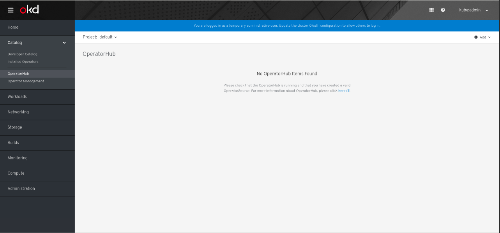

# Troubleshooting Marketplace Operator

This document lists out some common failures related to the Marketplace Operator a user might encounter, along with ways to troubleshoot the failures. If you encouter a failure related to the Marketplace Operator that is not listed in this document, but should be, please open an issue or a PR to have the failure appended to this document. 

The troubleshooting steps listed here are for Marketplace resources like OperatorSource and CatalogSourceConfig. To troubleshoot [Operator-lifecycle-manager(OLM)](https://github.com/operator-framework/operator-lifecycle-manager) defined resources like ClusterServiceVersion, InstallPlan, Subscription etc, refer to the [OLM troubleshooting guide](https://github.com/operator-framework/operator-lifecycle-manager/blob/master/Documentation/design/debugging.md).

Note that all examples in this doc are are meant to be ran against an OpenShift cluster. All examples (except for the ones involving the UI) should work with `kubectl` and with the appropriate namespaces substituted in them.   

Table of contents
===================

1. [No packages show up in the UI (No OperatorHub Items Found)](#no-packages-show-up-in-the-ui-(no-operatorhub-items-found))
2. [OperatorSource failing to download from datastore](#operatorSource-failing-to-download-from-datastore)
3. [OperatorSource `MESSAGE` reads unknown error (status 404)](#operatorsource-`message`-reads-unknown-error-(status-404)) 
4. [CatalogSourceConfig stuck in `Configuring` phase](#catalogsourceconfig-stuck-in-configuring-phase)
5. [Conflicting Package Names](#conflicting-package-names)


## No packages show up in the UI (No OperatorHub Items Found)

When you install an OpenShift cluster, OperatorHub comes with a default list of operators that can be installed onto the cluster. A number of resources need to be investigated if however you see a message like this: 




First, investigate the OperatorSources. 

```
$ oc get opsrc -n openshift-marketplace

NAME                  TYPE          ENDPOINT              REGISTRY              DISPLAYNAME           PUBLISHER   STATUS      MESSAGE                                       AGE
certified-operators   appregistry   https://quay.io/cnr   certified-operators   Certified Operators   Red Hat     Succeeded   The object has been successfully reconciled   22h
community-operators   appregistry   https://quay.io/cnr   community-operators   Community Operators   Red Hat     Succeeded   The object has been successfully reconciled   22h
redhat-operators      appregistry   https://quay.io/cnr   redhat-operators      Red Hat Operators     Red Hat     Succeeded   The object has been successfully reconciled   22h
```

If the status of any of the OperatorSource is anything other than `Succeeded`, you can investigate the OperatorSource with 
`oc describe opsrc <Name-of-OperatorSource> -n openshift-marketplace`. [This section](#operatorSource-failing-to-download-from-datastore) of the doc also contains helpful information about debugging an OperatorSource. 

If the OperatorSources look healthy, check that the CatalogSourceConfigs for the corresponding OperatorSources were created.

```
$ oc get csc -n openshift-marketplace

NAME                  STATUS      MESSAGE                                       AGE
certified-operators   Succeeded   The object has been successfully reconciled   23h
community-operators   Succeeded   The object has been successfully reconciled   23h
redhat-operators      Succeeded   The object has been successfully reconciled   23h
```

If the status of any of the CatalogSourceConfigs is anything other than `Succeeded`, inspect the CatalogSourceConfig with `oc describe csc <Name-of-CatalogSourceConfig>`. [This section](#catalogsourceconfig-stuck-in-configuring-phase) of the doc also contains helpful information about debugging a CatalogSourceConfig. 

If the CatalogSourceConfigs look healthy, make sure that there's a pod corresponding to each CatalogSourceConfig and that they are in the `Running` state.

```
$ oc get pods -n openshift-marketplace

NAME                                    READY     STATUS    RESTARTS   AGE
certified-operators-79f876c76d-mbtjg    1/1       Running   0          86m
community-operators-854c564f5f-9vk2x    1/1       Running   0          86m
marketplace-operator-6dcd66cb8c-2wmkz   1/1       Running   0          86m
redhat-operators-647fd668fc-9ff5d       1/1       Running   0          86m

```

If any pod is in a state other than `Running` inspect the logs of the pod with `oc logs <Name-of-Pod>`.

If all pods look healthy, make sure that there's a CatalogSource for each corresponding CatalogSourceConfigs.

```
$ oc get catalogsource -n openshift-marketplace 

NAME                  NAME                  TYPE      PUBLISHER   AGE
certified-operators   Certified Operators   grpc      Red Hat     23h
community-operators   Community Operators   grpc      Red Hat     23h
redhat-operators      Red Hat Operators     grpc      Red Hat     23h

```
If you need help debugging the CatalogSources, see [Where to go for help](#where-to-go-for-help). 

Next, make sure that the `packagemanifests` were created by the `OLM package-server`. 

```
$ oc get packagemanifests -n openshift-marketplace

NAME                             CATALOG               AGE
packageserver                    OLM Operators         3h31m

```

If no `packagemanifests` were created, check the logs for the `package-server` pods.

```
$ oc get pods -n openshift-operator-lifecycle-manager -l app=packageserver

NAME                                READY     STATUS    RESTARTS   AGE
packageserver-6c664f6d76-jj24b      1/1       Running   0          3h54m
packageserver-6c664f6d76-kzpd9      1/1       Running   0          3h53m

$ oc logs packageserver-6c664f6d76-jj24b -n openshift-operator-lifecycle-manager
$ oc logs packageserver-6c664f6d76-kzpd9 -n openshift-operator-lifecycle-manager

```

The logs for the `package-server` pods should contain information about why it might have failed to detect the presence of the `CatalogSources`. If the `package-server` pod does not show up or is crashing (anything other than healthy), try killing the pod or editing the deployment you see when you `oc get deployments -n openshift-operator-lifecycle-manager`.

If everything seems healthy, and still no packages show up in the UI, it could be a browser issue. Check the the browser console to see the logs for possible errors. At any point in the steps above if the error looks too complicated to debug, see [Where to go for help](#where-to-go-for-help). 


## OperatorSource failing to download from datastore

If an OperatorSource fails to reconcile for any reason (i.e operators in that particular OperatorSource fail to show up in the UI), it might be helpful first inspect the `STATUS` and the `MESSAGE` of the OperatorSource with `oc get opsrc -n openshift-marketplace`. You can also inspect the log messages of the marketplace-operator for detailed information about the OperatorSource. 

Note: A common reason for an OperatorSource to not reconcile correctly has been the use of the wrong [end point](https://github.com/operator-framework/operator-marketplace/blob/master/deploy/examples/community.operatorsource.cr.yaml#L8). Please make sure that the end point is specified as `https://quay.io/cnr`.

## OperatorSource `MESSAGE` reads unknown error (status 404)

Some of the common reasons we have encountered that caused this `MESSAGE` are quay.io being unavailable or the wrong end point being listed in the OperatorSource. If the steps listed [here](#operatorSource-failing-to-download-from-datastore) does not help debug the problem, please reach out to one of the forums listed in [Where to go for help](#where-to-go-for-help).   

## CatalogSourceConfig stuck in Configuring phase

If you are trying to [install an operator from the cli](https://github.com/operator-framework/operator-marketplace#installing-an-operator-using-marketplace), the packages listed in the CatalogSourceConfig must have valid package names. If you have private app-resgistries, please follow the steps listed [here](https://github.com/operator-framework/operator-marketplace/blob/master/docs/how-to-authenticate-private-repositories.md).

## Conflicting Package Names

Package names are global across OperatorSources. To avoid unexpected behavior users should avoid adding any OperatorSources that contain existing packages.

Users can view existing package names with the following command:

```bash
$ oc get packagemanifests -n openshift-marketplace
```

## Where to go for help

* #forum-operators channel in the [upstream Kubernetes slack instance](https://slack.k8s.io/)
* [google group for Operator-Framework](https://groups.google.com/forum/#!forum/operator-framework)